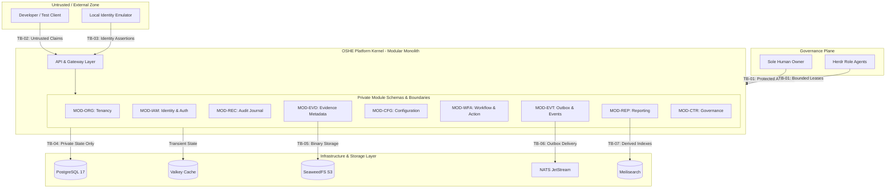
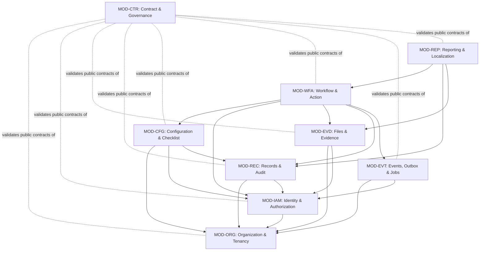

# v0.2.0 System Context, Runtime, Module, and Data-Authority Baseline

## 1. Governance Reference and Authority

This architectural baseline document establishes the authoritative system context, runtime component boundaries, module structure, and data-authority matrix for milestone `v0.2.0 - Shared Platform Kernel`.

- **Governing Issue:** GitHub Issue #37 (`[V020-I002] Document System Context, Runtime, Module, and Data-Authority Baseline`).
- **Governing Owner Decision:** `HDEC-V020-GATE-B-APPROVAL-051` (*v0.2.0 Gate B Entry and Local-Synthetic Implementation Baseline*), enacted by the Sole Human Owner on 2026-09-04.
- **Related Architectural Decisions:**
  - `ADR-0001`: Core Architecture — Modular Monolith.
  - `ADR-0002`: Shared Codebase and Deployment Profiles.
  - `ADR-0003`: Two-Level Membership and Scoped Access Model.
  - `ADR-0005`: Sole Human Owner and Herdr Role Agent Operating Model.

### Explicit Non-Completion and Boundary Attestation
This document establishes the governing architectural specification for GitHub Issue #37 only. It makes **zero claim of implementation, qualification, release, or deployment completion**. All runtime assertions herein define the mandated architecture for subsequent implementation slices (`V020-I003` through `V020-I010`).

---

## 2. Local-Synthetic System Context

### 2.1 Scope and Walking Skeleton Focus
The system of interest is the OSHE shared platform kernel and capability engines required to execute the approved `OSHE Inspect` walking skeleton (`V020-D01`). The system operates under a single supported local development and internal engineering alpha profile (`V020-D02`).

### 2.2 Operating Boundary and Synthetic Data Invariant
Per decision `V020-D05`, the system operates exclusively on **synthetic or redacted low-risk engineering data**. The following data classifications are strictly prohibited from entering the v0.2.0 runtime environment:
- Production credentials, private keys, or API tokens;
- Live customer operational data;
- Medical or occupational health personal data;
- Security-case and investigation evidence;
- Legal-privileged records.

### 2.3 System Context Actors and Adjacent Components

| Actor / Component | Nature | Role in v0.2.0 Local-Synthetic Baseline |
| :--- | :--- | :--- |
| **Sole Human Owner** | Human Authority | Holds non-delegable approval over protected scope, architecture deviations, residual risk, and release decisions (`ADR-0005`). |
| **Herdr Role Agents** | Governed Agents | Execute bounded planning, implementation, verification, and evidence authoring under explicit leases. |
| **Developer / Test Client** | Local User | Drives authenticated API commands, synthetic inspection workflows, and verification test suites. |
| **Controlled Internal Evaluator** | Alpha User | Exercises walking-skeleton journeys in approved internal alpha environments after Gate B qualification. |
| **Local Identity Emulator** | Local Component | Emulates authentication and issues signed synthetic identity assertions (`V020-D11`); no external IDP. |
| **Relational Database (PostgreSQL 17)** | Local Infrastructure | Houses module-owned private relational schemas, audit journals, and outbox tables. |
| **Object Store (SeaweedFS S3)** | Local Infrastructure | Persists immutable binary evidence files via standard S3 API (`V020-D12`). |
| **Message Broker (NATS JetStream)** | Local Infrastructure | Mediates asynchronous fact delivery and transactional outbox job queues (`V020-D12`). |
| **Cache & State Store (Valkey 9)** | Local Infrastructure | Handles transient session data and short-lived caching. |
| **Search Engine (Meilisearch 1.51)** | Local Infrastructure | Indexes derived read models for fast locale-aware search queries. |
| **Local Report Renderer** | Local Component | Compiles deterministic PDF/HTML inspection reports from immutable records (`V020-D12`). |
| **Diagnostics (OpenTelemetry)** | Local Component | Collects local, redacted traces and telemetry without external SaaS export. |

---

## 3. Primary Trust Boundaries

The system architecture enforces eight formal trust boundaries (TB-01 through TB-08):



- **TB-01: Human and Agent Governance Boundary:** Automated agents operate strictly within leased assignments; they cannot expand authority, self-approve gates, or accept residual risk.
- **TB-02: Client-to-Application Boundary:** All client-supplied tenant, membership, and permission headers are treated as untrusted input. The server derives authoritative tenant context strictly from verified identity and server-side membership records.
- **TB-03: Identity Assertion Boundary:** Identity claims are validated exclusively from the local identity adapter. No external network endpoints are consulted.
- **TB-04: Inter-Module Encapsulation Boundary:** Each module strictly owns its database tables and in-memory domain models. Cross-module database joins, direct table writes, and private model exports are architecturally prohibited.
- **TB-05: Database vs. Object Storage Boundary:** Structured metadata resides in PostgreSQL; unstructured binary evidence resides in SeaweedFS S3. Binary objects are immutable once written.
- **TB-06: Outbox and Asynchronous Message Boundary:** Outbox entries are written atomically within the business transaction. Event consumers must be idempotent and cannot modify source module state directly.
- **TB-07: Derived Output Boundary:** Search indexes (Meilisearch), report documents, and dashboards are strictly derived projections. They never constitute operational authority.
- **TB-08: Site-Edge / Offline Boundary:** v0.2.0 establishes contract compatibility for future edge nodes, but does not implement last-write-wins conflict resolution for safety-critical states.

---

## 4. The Nine Approved Modules and Data Authority Matrix

Per `modules/module-registry.yaml` and `HDEC-V020-GATE-B-APPROVAL-051` (`V020-D04`), the kernel comprises exactly nine approved modules:

| Module ID | Module Name | Topic | Data Ownership & Authority | Allowed Dependencies | Candidate Public Contracts |
| :--- | :--- | :--- | :--- | :--- | :--- |
| **`MOD-ORG`** | Organization & Tenancy | `V020-T01` | **Authoritative for:** Tenants, companies, projects, sites, areas, and organizational context. | *None* (Root context) | `CreateOrganizationContext`, `GetTenantScope`, `AssertIdentifier` |
| **`MOD-IAM`** | Identity & Authorization | `V020-T02` | **Authoritative for:** Identity mappings, two-level memberships, roles, permissions, and revocation records. | `MOD-ORG` | `ResolveAuthorizationContext`, `EvaluatePermission`, `GetMemberScope` |
| **`MOD-EVD`** | Files & Evidence | `V020-T03` | **Authoritative for:** File metadata, S3 storage keys, cryptographic hashes (SHA-256), retention tags. | `MOD-ORG`, `MOD-IAM` | `RegisterEvidenceFile`, `GetEvidenceMetadata`, `VerifyFileIntegrity` |
| **`MOD-REC`** | Records & Audit | `V020-T03` | **Authoritative for:** Append-only security and operational audit journals, correlation tracing, version snapshots. | `MOD-ORG`, `MOD-IAM` | `RecordAuditEvent`, `GetAuditTrail`, `QueryRecordSnapshot` |
| **`MOD-CFG`** | Configuration & Checklist | `V020-T04` | **Authoritative for:** Inspection templates, checklist definitions, versioning, scoring formulas, publication status. | `MOD-ORG`, `MOD-IAM`, `MOD-REC` | `GetPublishedChecklist`, `ValidateChecklistVersion`, `PublishTemplate` |
| **`MOD-WFA`** | Workflow & Action | `V020-T04` | **Authoritative for:** Inspection instances, checklist responses, findings, corrective action plans, review/closure states. | `MOD-CFG`, `MOD-IAM`, `MOD-EVD`, `MOD-REC`, `MOD-EVT` | `StartInspection`, `SubmitFinding`, `TransitionActionState`, `CloseInspection` |
| **`MOD-EVT`** | Events, Outbox & Jobs | `V020-T05` | **Authoritative for:** Outbox message queues, event delivery state, retry counters, dead-letter records. | `MOD-ORG`, `MOD-IAM` | `EnqueueOutboxEvent`, `ProcessPendingJobs`, `GetDeliveryStatus` |
| **`MOD-REP`** | Reporting & Localization | `V020-T06` | **Authoritative for:** Report templates, export definitions, Thai/English locale settings. *(Derived data only)* | `MOD-WFA`, `MOD-REC`, `MOD-EVD` | `GenerateInspectionReport`, `GetLocaleStrings`, `ExportReportPackage` |
| **`MOD-CTR`** | Contract & Migration Governance | `V020-T07` | **Authoritative for:** Versioned contract schemas, schema migration metadata (M0-M2), compatibility records. | *All modules (schema-level only)* | `ValidateContractCompatibility`, `RegisterMigration`, `GetSchemaDefinition` |

---

## 5. Architectural Dependency Direction and Rules

### 5.1 Permitted Dependency Direction (DAG)
The dependency direction between modules forms a strict Directed Acyclic Graph (DAG):



### 5.2 Mandatory Cross-Module Prohibitions
To ensure long-term maintainability and system modularity, the following rules are non-negotiable:
1. **Zero Private Table Cross-Reads/Writes:** No module may query or mutate another module's private database tables. All interaction occurs via public contract interfaces.
2. **Zero Shared Mutable State:** Shared domain entities across modules are prohibited. Data exchange must use explicit DTOs, primitive identifiers, or immutable event payloads.
3. **Derived Data Subordination:** Projections created by `MOD-REP` (reports, search documents) cannot be used as operational authority for business logic decisions.
4. **Outbox Commitment Invariant:** Events emitted through `MOD-EVT` must be staged within the same database transaction as the business state change to guarantee at-least-once delivery without phantom events.
5. **Fail-Closed Authorization:** Missing tenant context, unverified scope, or invalid role assertions must immediately fail closed with an explicit authorization rejection.

---

## 6. Runtime Component Boundaries and Local Adapter Posture

Per decisions `V020-D03`, `V020-D11`, and `V020-D12`, the runtime component baseline enforces an **adapter-first, local-only posture**:

```
+-------------------------------------------------------------------------+
|                    OSHE Platform Runtime Container                      |
|                                                                         |
|  +-------------------+  +--------------------+  +--------------------+  |
|  |     apps/api      |  |    apps/worker     |  |      apps/web      |  |
|  |  (REST/HTTP Core) |  | (Outbox / Jobs)    |  |  (Static / UI SPA) |  |
|  +--------+----------+  +---------+----------+  +---------+----------+  |
|           |                       |                       |             |
|  +--------v-----------------------v-----------------------v----------+  |
|  |                   Modular Monolith Internal Core                   |  |
|  |       [MOD-ORG] [MOD-IAM] [MOD-EVD] [MOD-REC] [MOD-CFG]            |  |
|  |                 [MOD-WFA] [MOD-EVT] [MOD-REP] [MOD-CTR]            |  |
|  +--------+-----------------------+-----------------------+----------+  |
|           |                       |                       |             |
|  +--------v----------+  +---------v----------+  +---------v----------+  |
|  | Identity Adapter  |  | S3 Storage Adapter |  | Event Bus Adapter  |  |
|  | (Local Mock/Emu)  |  | (SeaweedFS Client) |  |  (NATS JetStream)  |  |
|  +-------------------+  +--------------------+  +--------------------+  |
+-----------|-----------------------|-----------------------|-------------+
            |                       |                       |              
+-----------v-----------------------v-----------------------v-------------+
|               Verified Local Docker Stack (deploy/local/)               |
|                                                                         |
|  [PostgreSQL 17]     [SeaweedFS 4.29]     [NATS 2.14.5]                 |
|  (Schemas/Outbox)    (Binary S3 Store)    (Event Broker)                |
|                                                                         |
|  [Valkey 9.1.1]      [Meilisearch 1.51]                                 |
|  (Session/Cache)     (Search Projections)                               |
+-------------------------------------------------------------------------+
```

### Local Adapter Specifications
1. **Identity Adapter:** In-memory / local emulator issuing signed synthetic claims. Zero live OAuth2 / OIDC network traffic.
2. **Object Storage Adapter:** Standard AWS SDK v2 client pointed at local SeaweedFS S3 endpoint (`http://127.0.0.1:8333`).
3. **Event Bus Adapter:** NATS Go client connecting to local NATS JetStream server (`nats://127.0.0.1:4222`).
4. **Relational Database Client:** Standard `pgx` driver connecting to PostgreSQL (`postgres://oshe_app@127.0.0.1:5432/oshe_dev`).
5. **Search Client:** Meilisearch client communicating with local instance (`http://127.0.0.1:7700`).

---

## 7. Quality and Verification Traceability

Implementation slices governed by this baseline must provide verifiable proof against this document:
- **Contract Verification:** Contracts registered under `contracts/` must validate against `MOD-CTR` schemas.
- **Tenant Isolation Negative Controls:** Every data access method must undergo automated negative tests demonstrating that access across tenant boundaries is strictly rejected.
- **Outbox Concurrency Tests:** Transactional outbox logic must demonstrate zero message loss under forced process termination.
- **Evidence Integrity Verification:** Stored evidence files must demonstrate SHA-256 bit-level verification upon retrieval.
