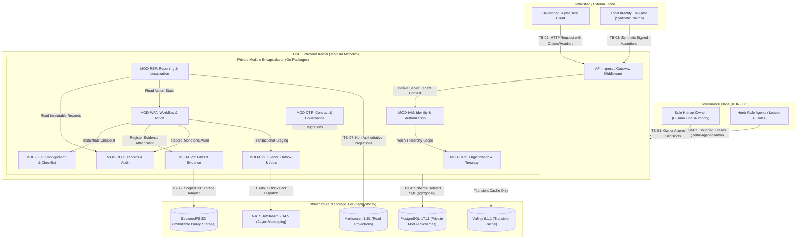
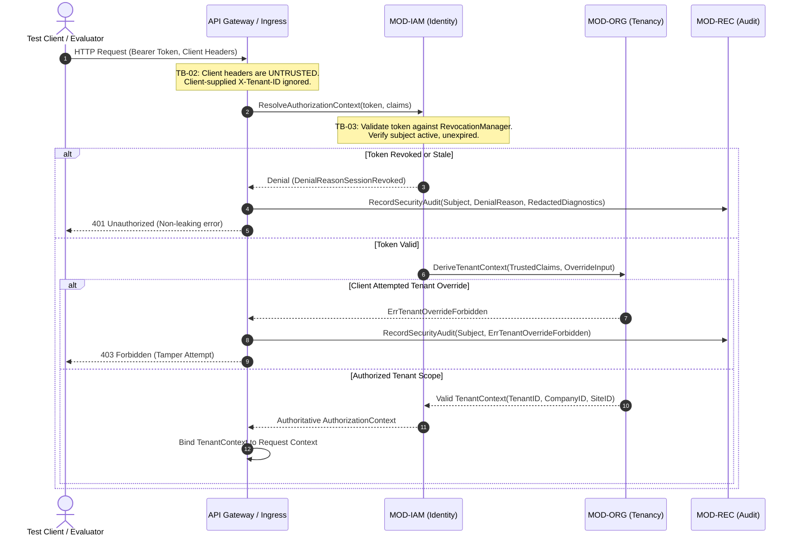
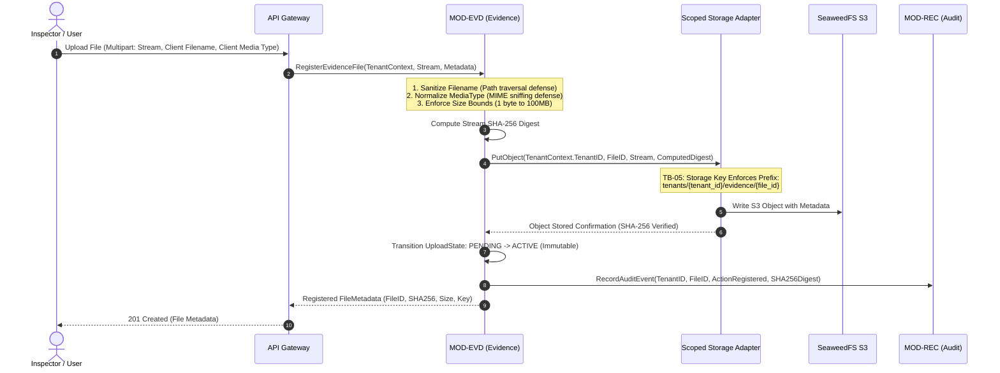
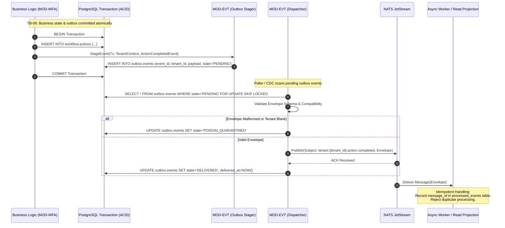
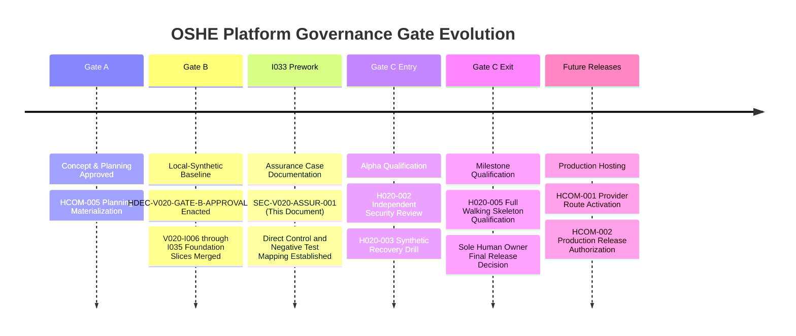

# v0.2.0 System Context, Trust Boundary, Data Flow, and Tenant Isolation Assurance Case

## 1. Governance Reference, Purpose, and Status Boundary

### 1.1 Governance Authority and Scope
This document establishes the authoritative security, data flow, trust boundary, and tenant-isolation assurance case for **Milestone v0.2.0 — Shared Platform Kernel** within `OSHEThai/oshe-platform`. It fulfills the deliverables and acceptance criteria defined under GitHub Issue #68 (`[V020-I033] Create System Context, Trust Boundary, Data Flow, and Tenant Isolation Assurance Case`) under Topic `V020-T08`.

- **Governing Human Decisions:**
  - `HDEC-V020-GATE-B-APPROVAL-051`: Authorized entry into Gate B and adoption of the local-synthetic implementation baseline.
  - `HCOM-005`: Authorized planning-only materialization of milestone issues and assurance foundations.
- **Architectural Reference Baselines:**
  - `ARC-V020-SYSBASE-001` (`docs/architecture/v0.2.0-system-context-and-module-baseline.md`): Establishes the 8 primary trust boundaries (TB-01 through TB-08) and 9 approved module authorities.
  - `TST-V020-PLAN-001` (`docs/qualification/v0.2.0-test-assurance-and-evidence-plan.md`): Defines the walking-skeleton journeys (WS-01 through WS-08) and evidence contracts.
  - `ADR-0001` (Modular Monolith), `ADR-0002` (Shared Codebase & Deployment Profiles), `ADR-0003` (Two-Level Membership & Scoped Access), `ADR-0005` (Sole Human Owner & Herdr Role Agents), `ADR-0006` (Evidence-Gated Full GitHub Operator Authority), and `ADR-0007` (Local-First CI & Repository Lifecycle).

### 1.2 Strict Status Boundary and Provisional Attestation
In accordance with project governance rules, this document constitutes a **provisional planning and foundation assurance case**:
1. **Foundation Synthesis:** This assurance case is synthesized strictly from merged local-synthetic foundations (`V020-I006` through `V020-I035`), frozen schemas, in-memory domain models, and deterministic test fixtures.
2. **Provisional Runtime Designation:** All live infrastructure components—including multi-tenant PostgreSQL clustering, distributed SeaweedFS S3 clusters, live NATS JetStream messaging daemons, Valkey caching layers, Meilisearch daemons, and live HTTP listeners (`apps/api`)—are **unobserved, provisional, and non-executed in production**.
3. **Zero Production / Customer Data Claim:** This document makes **zero claim of production readiness, public deployment, live tenant data hosting, or residual-risk acceptance**.
4. **Human Authority Invariant:** Residual risk acceptance, cryptographic signing of public distribution artifacts, and release promotion remain the exclusive, non-delegable prerogative of the Sole Human Owner (`ADR-0005`).

---

## 2. System Context and End-to-End Data Flow (DFD)

### 2.1 System Context Model
The v0.2.0 system context comprises four distinct security zones: Untrusted External Zone, Governance Plane, Modular Monolith Kernel, and Infrastructure / Storage Tier.



---

### 2.2 Data Flow Analysis Across Primary Journeys

#### DFD-01: Client Ingress and Tenant Derivation Flow


#### DFD-02: Evidence Upload, Content Digest Verification, and Storage Scoping


#### DFD-03: Transactional Outbox Staging and Event Dispatch


---

## 3. Comprehensive Trust Boundary Analysis (TB-01 through TB-08)

### 3.1 TB-01: Human and Agent Governance Boundary
- **Boundary Description:** Separates human sovereign governance authority from autonomous Herdr role agents executing bounded engineering assignments.
- **Threat Vector:** Autonomous agent privilege escalation, unauthorized promotion of release artifacts, self-approval of quality gates, tampering with lease assignments, or accepting residual risk without human consent.
- **Preventive Controls:**
  1. Leased execution governance (`ADR-0005`): Every agent operation requires an active, unexpired lease (`.oshe-agent-control/leases/active/`) bound to a specific role profile and workspace worktree.
  2. Non-delegable Sole Human Owner authority: Release decisions, Gate C exit approval, production secrets management, and residual risk acceptance strictly require human sign-off (`HDEC-*`).
  3. Static governance policies (`.ai/policies/governance.yaml`): Automated pre-commit and pre-push hooks reject unauthorized commits.
- **Detective Controls:**
  1. `tools/validate_agent_os.py`: Validates role-agent limits, profile schemas, and lease invariants.
  2. Independent review leases (`IRL`): Every candidate artifact must be challenged by the Independent Review and Challenge Agent before merge.
- **Evidenced Negative Verification:**
  - `tests/test_permission_delegation.py`: Confirms unauthorized role delegation and out-of-scope leases are rejected.
  - `tests/test_validate_agent_os.py`: Asserts fail-closed enforcement when roles violate permission ceilings.
- **Responsible Owner:** Sole Human Owner & Independent Review Lead.

---

### 3.2 TB-02: Client-to-Application Ingress Boundary
- **Boundary Description:** Separates external untrusted clients (developer clients, test runners, mobile devices, web UI) from internal platform services.
- **Threat Vector:** Forged tenant headers (`X-Tenant-ID`), tampered identity tokens, insecure direct object reference (IDOR), SQL/command injection, and unauthorized parameter overriding.
- **Preventive Controls:**
  1. Header Untrust Invariant: Client-provided tenancy headers are discarded. Tenant context is derived strictly on the server from authenticated credentials via `MOD-IAM` and `MOD-ORG` (`DeriveTenantContext`).
  2. Explicit Override Denial: Any client attempt to inject `ClientOverrideInput` triggers `ErrTenantOverrideForbidden` and immediate request termination.
  3. Canonical Identifier Regex: All incoming entity references must match `^[a-z0-9]{2,16}_[0-9a-f]{32}$`.
- **Detective Controls:**
  1. Security Audit Logging: All unauthorized access attempts, missing claims, and tenant mismatches are written to the append-only security journal via `MOD-REC`.
  2. Non-Leaking Diagnostics: Diagnostic logs scrub internal stack traces, tokens, and tenant IDs using `RedactedDiagnostics`.
- **Evidenced Negative Verification:**
  - `modules/organization-tenancy/tenant_context_test.go`:
    - `TestDeriveTenantContext_MissingClaims`: Rejects requests without claims (`ErrMissingClaims`).
    - `TestDeriveTenantContext_Unauthenticated`: Rejects unauthenticated tokens (`ErrUnauthenticated`).
    - `TestDeriveTenantContext_OverrideDenial`: Denies forged client overrides (`ErrTenantOverrideForbidden`).
    - `TestAuthorizeTenantScope_CrossTenantDenial`: Rejects cross-tenant scope access (`ErrTenantMismatch`).
  - `modules/identity-authorization/negative_controls_test.go`:
    - `TestNegativeControl_AnonymousAndUnauthenticated`: Evaluates default-deny for anonymous requests.
    - `TestNegativeControl_CrossTenantMismatch`: Confirms cross-tenant requests fail closed.
    - `TestNegativeControl_DirectObjectIDORMismatch`: Detects and blocks IDOR resource traversal.
    - `TestNegativeControl_NonLeakingDiagnostics`: Verifies zero sensitive token/credential leakage in error responses.
- **Responsible Owner:** Security, Privacy, and Product Safety Agent.

---

### 3.3 TB-03: Identity Assertion and Session Boundary
- **Boundary Description:** Separates identity claim producers from platform consumers, enforcing session validity and revocation states.
- **Threat Vector:** Replay of revoked sessions, stale session tokens, malformed JWTs/claims, identity spoofing, and lateral privilege escalation across projects.
- **Preventive Controls:**
  1. Local Synthetic Identity Adapter (`V020-D11`): In v0.2.0, identity is provided exclusively via local cryptographic assertions; zero external IdP traffic is permitted.
  2. Real-Time Revocation Registry (`RevocationManager`): Policy evaluator checks session revocation state and monotonic timestamp validity prior to every authorization decision.
  3. Default-Deny Access Policy: Inactive, suspended, or disabled subjects are denied access immediately (`DenialReasonIdentityDisabled`).
- **Detective Controls:**
  1. Revocation audit log entries recording subject revocation, timestamp, and revoking authority.
  2. Metric counters tracking revoked session reuse attempts.
- **Evidenced Negative Verification:**
  - `modules/identity-authorization/negative_controls_test.go`:
    - `TestNegativeControl_MalformedAndInvalidTokens`: Confirms malformed tokens are rejected.
    - `TestNegativeControl_ExpiredAndRevokedSessions`: Rejects revoked sessions via `RevocationManager`.
    - `TestNegativeControl_StaleSessionAndPolicyInvalidation`: Verifies cache invalidation upon policy change.
    - `TestNegativeControl_DisabledIdentity`: Confirms disabled users are blocked.
  - `modules/identity-authorization/session_revocation_test.go`:
    - Complete unit verification of revocation storage, TTL expiration, and race-free invalidation.
- **Responsible Owner:** Security, Privacy, and Product Safety Agent.

---

### 3.4 TB-04: Inter-Module Encapsulation Boundary
- **Boundary Description:** Separates the private internal domain logic, data models, and database schemas of the 9 approved platform modules.
- **Threat Vector:** Architectural erosion via cross-module database joins, direct table writes, private model coupling, bypassing business rule transitions, and circular dependency deadlocks.
- **Preventive Controls:**
  1. Private Schema Ownership: Each module owns dedicated PostgreSQL schemas (`org`, `iam`, `evidence`, `audit`, `config`, `workflow`, `outbox`, `reporting`, `contract`). Cross-schema SQL joins and writes are strictly forbidden.
  2. Public Go Contract Interfaces: All inter-module interaction proceeds exclusively through typed contracts in `contracts/api` or public Go interfaces (`GetTenantScope`, `RecordAuditEvent`, `RegisterEvidenceFile`).
  3. Directed Acyclic Graph (DAG): Module dependency direction is strictly top-down per `ARC-V020-SYSBASE-001` Section 5.
- **Detective Controls:**
  1. Static architecture linter in local CI checking prohibited import paths.
  2. `MOD-CTR` Compatibility Registry: Validates public contract schema changes against compatibility rules.
- **Evidenced Negative Verification:**
  - `modules/contract-migration-governance/compatibility_registry_test.go`:
    - `TestCompatibilityRegistry_IncompatibleEvolution_DeniedWithoutMigrationPath`: Blocks breaking contract evolutions lacking migration paths.
    - `TestCompatibilityRegistry_OwnershipIsolationAndDefensiveCopy`: Ensures modules cannot mutate foreign registry definitions.
    - `TestCompatibilityRegistry_DuplicateAndVersionDenials`: Prevents contract hijacking or duplicate registrations.
  - `tests/test_api_contracts.py`: Validates contract schemas against central JSON schemas.
- **Responsible Owner:** Architecture Lead & Engineering Lead.

---

### 3.5 TB-05: Database vs. Object Storage Boundary
- **Boundary Description:** Separates structured transactional metadata (PostgreSQL) from unstructured, binary evidence files (SeaweedFS S3).
- **Threat Vector:** Unbounded file uploads causing DoS, malicious file path traversal, MIME type confusion, binary tampering, cross-tenant file exfiltration, and orphaned binary records.
- **Preventive Controls:**
  1. Scoped Storage Adapter: Enforces strict tenant-isolated bucket/key namespaces: `tenants/{tenant_id}/evidence/{file_id}`.
  2. Cryptographic Digest Verification: Every uploaded file stream is hashed with SHA-256 during ingress; storage write fails if the payload does not match the asserted digest.
  3. Size & Format Bounds: Files must satisfy `1 byte <= size <= 100MB`. Media types must be normalized; filenames are sanitized of path traversal characters (`..`, `/`, `\`).
  4. Write-Once Immutability: S3 objects are immutable once written; overwriting existing keys is rejected.
- **Detective Controls:**
  1. SHA-256 re-verification on retrieval ensures bit-level integrity before serving files.
  2. Periodic audit reconciliation compares PostgreSQL metadata against S3 bucket object lists.
- **Evidenced Negative Verification:**
  - `modules/files-evidence/storage_adapter_test.go`:
    - `TestMemoryStorageAdapter_PutDigestMismatch`: Confirms upload failure when content digest deviates.
    - `TestMemoryStorageAdapter_CrossTenantIsolation`: Proves Tenant A cannot read Tenant B's storage keys.
    - `TestMemoryStorageAdapter_SizeCapacityCheck`: Enforces max size boundaries.
  - `modules/files-evidence/file_metadata_test.go`:
    - `TestValidateFilename_MaliciousAndInvalidInputs`: Rejects path traversal and dangerous characters.
    - `TestNormalizeAndValidateMediaType_ValidAndInvalid`: Validates MIME type whitelist.
    - `TestAuthorizeStorageReference_TenantIsolation`: Confirms tenant scope enforcement on metadata retrieval.
    - `TestUploadLifecycleState_InvalidTransitions`: Enforces upload state machine invariants.
- **Responsible Owner:** Release and Evidence Lead.

---

### 3.6 TB-06: Outbox and Asynchronous Message Boundary
- **Boundary Description:** Separates synchronous ACID domain transactions from asynchronous message queuing and consumer event processing.
- **Threat Vector:** Split-brain transactions (data committed without event or vice versa), duplicate message processing causing duplicate charges/state transitions, event poisoning, cross-tenant message snooping, and replay attacks.
- **Preventive Controls:**
  1. Transactional Outbox Pattern: Event records are written into the `outbox.events` table inside the exact same database transaction as the domain state change.
  2. Tenant-Encapsulated Envelope: Every outbox event payload is sealed inside a standardized correlation envelope containing mandatory `tenant_id`, `event_id`, and `schema_version`.
  3. Dead-Letter Quarantine: Events failing dispatch after maximum retry limits are isolated into a poison quarantine queue without blocking the queue.
  4. Consumer Idempotency: All message consumers must maintain an idempotency journal of processed `event_id`s.
- **Detective Controls:**
  1. Outbox lag metrics track dispatch latency and pending queue depth.
  2. Poison queue alerts notify operators of corrupted or incompatible messages.
- **Evidenced Negative Verification:**
  - `modules/events-outbox-jobs/event_outbox_test.go`:
    - `TestOutbox_Rollback`: Proves rolled-back business transactions never emit outbox events.
    - `TestOutbox_PreCommitInvisibility`: Confirms uncommitted outbox events are invisible to dispatchers.
    - `TestOutbox_TenantMismatch`: Prevents staging events with tenant IDs differing from the transaction context.
    - `TestOutbox_DuplicateEventID`: Enforces monotonic uniqueness of event identifiers.
  - `modules/events-outbox-jobs/event_dispatcher_test.go`:
    - `TestDuplicateDispatch_Idempotency`: Asserts safe idempotent consumer replay.
    - `TestPoisonEventQuarantine`: Verifies quarantine of invalid/failing events.
    - `TestTenantIsolation`: Proves tenant event isolation during dispatch.
    - `TestCrashRestartStateReconstruction`: Demonstrates crash recovery without event loss.
- **Responsible Owner:** Data & Integration Lead.

---

### 3.7 TB-07: Derived Output & Projection Boundary
- **Boundary Description:** Separates authoritative transactional records from derived, non-authoritative read models (Meilisearch indexes, Valkey cache, generated inspection reports).
- **Threat Vector:** Operational reliance on stale or unverified projections, cross-tenant data leakage in search results or batch reports, and projection tampering.
- **Preventive Controls:**
  1. Subordination Rule (`ADR-0001` & `data-projection-boundaries.md`): Read models (Meilisearch, Valkey, PDFs) are strictly non-authoritative. Business state transitions may **never** rely on query results from derived projections.
  2. Scoped Projection Pipelines: Meilisearch documents and reporting queries are partitioned by `tenant_id`.
  3. Deterministic Report Generation: Reports include audit headers, timestamp limits, checklist definition versions, and SHA-256 digests of referenced evidence.
- **Detective Controls:**
  1. Projection reconciliation jobs compare Meilisearch document counts with authoritative PostgreSQL counts.
  2. Report rendering validation checks that referenced audit events match source records.
- **Evidenced Negative Verification:**
  - `modules/reporting-localization/reporting_test.go`:
    - `TestCrossTenantDenial`: Blocks cross-tenant access to generated reports and metrics.
    - `TestUnauthorizedQueryDenial`: Asserts fail-closed query rejection for unpermitted roles.
    - `TestAllowedFilterEnforcement`: Prevents filter injection or unconstrained tenant queries.
    - `TestDerivedResultNonAuthority`: Asserts business logic cannot consume report outputs as authority.
    - `TestStaleMetricVisibility`: Flags stale projections and displays explicit staleness indicators.
- **Responsible Owner:** Test & Quality Lead.

---

### 3.8 TB-08: Site-Edge / Offline Boundary
- **Boundary Description:** Separates local edge nodes / mobile offline devices from the central platform kernel.
- **Threat Vector:** Offline race conditions, conflicting offline edits overwriting verified findings, blind Last-Write-Wins (LWW) corrupting safety data, and synchronization of corrupted offline state.
- **Preventive Controls:**
  1. Prohibition of Blind LWW (`TST-V020-PLAN-001`): Blind last-write-wins is architecturally forbidden for safety-critical states.
  2. Immutable Template Snapshots (`MOD-CFG`): Offline inspection instances bind to immutable checklist versions (`InstantiateChecklist`), ensuring definition changes cannot invalidate in-flight inspections.
  3. Conflict Detection and Causal Ordering: Synchronized findings include causal vector clocks; concurrent modifications require human review before resolution.
- **Detective Controls:**
  1. Synchronization audit logs capture edge client timestamps, receipt timestamps, and divergence markers.
- **Evidenced Negative Verification:**
  - `modules/configuration-checklist/template_lifecycle_test.go`:
    - `TestTemplateLifecycle_InstantiateAndStaleVersionRetention`: Proves inspections retain historical template snapshots even after updates.
    - `TestTemplateLifecycle_PublishedMutationRejection`: Guarantees published templates cannot be mutated in place.
  - `modules/workflow-action/business_rules_test.go`:
    - `TestQualification_RollbackAndNonMutationOnDenial`: Proves invalid state transitions do not mutate current state.
    - `TestQualification_VersionCompatibility`: Rejects executions bound to incompatible template versions.
  - `modules/records-audit/record_audit_test.go`:
    - `TestRecordStore_VersionPreservationAndSnapshotImmutability`: Verifies immutable version snapshots.
- **Responsible Owner:** Engineering Lead & Security Agent.

---

## 4. Tenant Isolation Architecture and Security Controls Matrix

### 4.1 Tenant Isolation Architecture Model
Tenant isolation in the v0.2.0 platform kernel operates across four synchronized planes:

```
+-------------------------------------------------------------------------------+
|                             1. IDENTITY PLANE                                 |
|  - Authenticated Subject -> Scoped Memberships (MOD-IAM)                      |
|  - Server-side TenantContext derivation (MOD-ORG)                             |
|  - Explicit prohibition of client tenant overrides (ErrTenantOverrideForbidden) |
+---------------------------------------+---------------------------------------+
                                        |
+---------------------------------------v---------------------------------------+
|                             2. DOMAIN PLANE                                   |
|  - All domain service APIs require context.Context containing TenantContext   |
|  - Entities tagged with tenant-scoped canonical IDs: <entity>_<hex32>         |
|  - Action state transitions enforce organization scope matching               |
+---------------------------------------+---------------------------------------+
                                        |
+---------------------------------------v---------------------------------------+
|                            3. PERSISTENCE PLANE                               |
|  - PostgreSQL schemas isolated per module; tenant_id indexed in every table   |
|  - S3 Object Store keys partitioned: tenants/{tenant_id}/evidence/{file_id}   |
|  - Append-only audit journals partitioned by tenant_id                        |
+---------------------------------------+---------------------------------------+
                                        |
+---------------------------------------v---------------------------------------+
|                           4. ASYNCHRONOUS PLANE                               |
|  - Transactional Outbox envelopes seal tenant_id in immutable header          |
|  - NATS JetStream event subjects namespaced: tenant.{tenant_id}.*             |
|  - Meilisearch indexes and Valkey cache keys prefixed: tenant:{tenant_id}:*   |
+-------------------------------------------------------------------------------+
```

### 4.2 Multi-Tenant Security Controls Matrix

| Boundary / Plane | Threat / Attack Vector | Preventive Control | Detective Control | Negative Qualification Test | Severity If Breached |
| :--- | :--- | :--- | :--- | :--- | :--- |
| **Ingress (TB-02)** | Tenant header spoofing (`X-Tenant-ID`) | Discard client headers; derive context strictly from verified token claims | Security audit log records forged override attempt | `orgtenancy.TestDeriveTenantContext_OverrideDenial` | **S0 (Blocker)** |
| **Ingress (TB-02)** | Unauthenticated anonymous access | Default-deny policy evaluator rejects unauthenticated requests | `DenialReasonUnauthenticated` audit log | `localidentity_test.TestNegativeControl_AnonymousAndUnauthenticated` | **S0 (Blocker)** |
| **Ingress (TB-02)** | Cross-tenant parameter manipulation (IDOR) | Verify target entity tenant ID matches caller tenant context | Audit logging of `ErrTenantMismatch` | `orgtenancy.TestAuthorizeTenantScope_CrossTenantDenial` | **S0 (Blocker)** |
| **Identity (TB-03)** | Replay of revoked session token | `RevocationManager` invalidates tokens immediately across all nodes | Real-time revocation lookup rejection | `localidentity_test.TestNegativeControl_ExpiredAndRevokedSessions` | **S0 (Blocker)** |
| **Identity (TB-03)** | Stale cached policy after role change | Evaluator flushes cache upon membership update | Audit log records policy revision mismatch | `localidentity_test.TestNegativeControl_StaleSessionAndPolicyInvalidation` | **S1 (Major)** |
| **Identity (TB-03)** | Privilege escalation across projects | Scoped authorization checks project/area hierarchy | `DenialReasonScopeMismatch` audit event | `localidentity_test.TestNegativeControl_ProjectAndAreaScopeMismatch` | **S0 (Blocker)** |
| **Module (TB-04)** | Cross-module direct database SQL join | Separate schemas per module; public contracts only | Static import scanner; contract compatibility evaluation | `cmg_test.TestCompatibilityRegistry_OwnershipIsolationAndDefensiveCopy` | **S1 (Major)** |
| **Storage (TB-05)** | Cross-tenant S3 file read / download | Storage adapter forces path prefix `tenants/{tenant_id}/` | Storage access denial logged with client IP and ID | `filesevidence.TestMemoryStorageAdapter_CrossTenantIsolation` | **S0 (Blocker)** |
| **Storage (TB-05)** | Binary file tampering / corruption | SHA-256 checksum calculated and matched on upload and read | Immediate abort on digest mismatch; alert raised | `filesevidence.TestMemoryStorageAdapter_PutDigestMismatch` | **S0 (Blocker)** |
| **Storage (TB-05)** | Path traversal in upload filename (`../../`) | Filename sanitized against path traversal and dangerous chars | Rejection logged with `ErrInvalidFilename` | `filesevidence.TestValidateFilename_MaliciousAndInvalidInputs` | **S1 (Major)** |
| **Audit (TB-04)** | Audit trail tampering or record deletion | Append-only store; updates/deletions architecturally prohibited | Monotonic sequence validation; tamper detection | `recordsaudit.TestRecordStore_AppendOnlyAuditAndMonotonicOrdering` | **S0 (Blocker)** |
| **Audit (TB-04)** | Cross-tenant audit journal exfiltration | Audit query APIs filter strictly by authenticated caller tenant | Access denied audit log for foreign tenant queries | `recordsaudit.TestRecordStore_UnauthorizedAuditAccessAndCrossTenantDenial` | **S0 (Blocker)** |
| **Workflow (TB-04)** | Unauthorized finding / action state transition | State machine verifies actor permissions and role transitions | State transition audit log records rejected transitions | `workflowaction.TestCrossTenantDenial` | **S0 (Blocker)** |
| **Workflow (TB-04)** | State mutation on failed business rule | Rollback-on-denial ensures zero side effects upon failure | Verification of state non-mutation | `workflowaction.TestQualification_RollbackAndNonMutationOnDenial` | **S1 (Major)** |
| **Outbox (TB-06)** | Outbox event tenant spoofing | Outbox stager validates event tenant matches database transaction | Outbox transaction rollback on mismatch | `eventsoutbox.TestOutbox_TenantMismatch` | **S0 (Blocker)** |
| **Outbox (TB-06)** | Duplicate event processing (replay) | Consumers enforce idempotent processing via processed ID journal | Duplicate detection log entry | `eventsoutbox.TestDuplicateDispatch_Idempotency` | **S1 (Major)** |
| **Outbox (TB-06)** | Poison message stalling message dispatcher | Dead-letter quarantine moves failing events out of stream | Poison queue alert and dead-letter log | `eventsoutbox.TestPoisonEventQuarantine` | **S1 (Major)** |
| **Reporting (TB-07)** | Cross-tenant leakage in generated reports | Report engine queries filter strictly by caller tenant context | Reporting query rejection log | `reporting.TestCrossTenantDenial` | **S0 (Blocker)** |
| **Reporting (TB-07)** | Operational decision based on derived view | Query APIs mark derived models non-authoritative | Business layer asserts primary database authority | `reporting.TestDerivedResultNonAuthority` | **S1 (Major)** |
| **Edge (TB-08)** | Blind last-write-wins overwriting safety state | Offline submissions require immutable version reference & review | Divergence and conflict detected upon sync | `cfgchecklist.TestTemplateLifecycle_InstantiateAndStaleVersionRetention` | **S0 (Blocker)** |

---

## 5. Evidenced Control and Test Mapping Matrix

This section establishes the direct cross-reference between governing requirements, architectural controls, automated test suites, and responsible agent roles.

```
========================================================================================================================
Boundary | Component | Control Name                   | Exact Test Function & Location               | Role Owner
========================================================================================================================
TB-01    | Agent OS  | Role Limit Enforcement         | tests/test_permission_delegation.py          | Independent Review
TB-01    | Agent OS  | Profile Schema Validation      | tests/test_validate_agent_os.py              | Security Lead
TB-02    | MOD-ORG   | Tenant Context Derivation      | modules/organization-tenancy/tenant_context_test.go
         |           | - Header Override Denial       |   -> TestDeriveTenantContext_OverrideDenial  | Security Lead
         |           | - Cross-Tenant Denial          |   -> TestAuthorizeTenantScope_CrossTenantDenial | Security Lead
         |           | - Missing Claims Handling      |   -> TestDeriveTenantContext_MissingClaims   | Security Lead
TB-02    | MOD-IAM   | Default-Deny Access Policy     | modules/identity-authorization/negative_controls_test.go
         |           | - Anonymous Access Rejection   |   -> TestNegativeControl_AnonymousAndUnauthenticated | Security Lead
         |           | - IDOR Traversal Defense       |   -> TestNegativeControl_DirectObjectIDORMismatch | Security Lead
         |           | - Diagnostic Data Scrubbing    |   -> TestNegativeControl_NonLeakingDiagnostics | Security Lead
TB-03    | MOD-IAM   | Real-time Session Revocation   | modules/identity-authorization/negative_controls_test.go
         |           | - Expired/Revoked Token Denial |   -> TestNegativeControl_ExpiredAndRevokedSessions | Security Lead
         |           | - Policy Cache Invalidation    |   -> TestNegativeControl_StaleSessionAndPolicyInvalidation | Security Lead
         |           | - Revocation Registry Unit     | modules/identity-authorization/session_revocation_test.go
         |           |                                |   -> TestRevocationManager_RevokeAndQuery    | Security Lead
TB-04    | MOD-CTR   | Inter-Module Contract Isolation| modules/contract-migration-governance/compatibility_registry_test.go
         |           | - Ownership Isolation          |   -> TestCompatibilityRegistry_OwnershipIsolationAndDefensiveCopy | Architecture Lead
         |           | - Incompatible Schema Rejection|   -> TestCompatibilityRegistry_IncompatibleEvolution_DeniedWithoutMigrationPath | Architecture Lead
TB-04    | MOD-REC   | Append-Only Audit Integrity    | modules/records-audit/record_audit_test.go
         |           | - Monotonic Audit Ordering     |   -> TestRecordStore_AppendOnlyAuditAndMonotonicOrdering | Test & Quality Lead
         |           | - Cross-Tenant Audit Denial    |   -> TestRecordStore_UnauthorizedAuditAccessAndCrossTenantDenial | Security Lead
         |           | - Immutable Version Snapshots  |   -> TestRecordStore_VersionPreservationAndSnapshotImmutability | Test & Quality Lead
TB-05    | MOD-EVD   | Scoped Object Storage Adapter  | modules/files-evidence/storage_adapter_test.go
         |           | - Cross-Tenant Storage Denial  |   -> TestMemoryStorageAdapter_CrossTenantIsolation | Release Lead
         |           | - SHA-256 Digest Verification  |   -> TestMemoryStorageAdapter_PutDigestMismatch | Release Lead
         |           | - Storage Capacity Enforcement |   -> TestMemoryStorageAdapter_SizeCapacityCheck | Release Lead
TB-05    | MOD-EVD   | File Metadata Validation       | modules/files-evidence/file_metadata_test.go
         |           | - Malicious Filename Defense   |   -> TestValidateFilename_MaliciousAndInvalidInputs | Release Lead
         |           | - MIME Type Whitelist          |   -> TestNormalizeAndValidateMediaType_ValidAndInvalid | Release Lead
         |           | - Upload State Transitions     |   -> TestUploadLifecycleState_TransitionsAndImmutability | Release Lead
TB-06    | MOD-EVT   | Transactional Outbox Pattern   | modules/events-outbox-jobs/event_outbox_test.go
         |           | - Transaction Rollback Safety  |   -> TestOutbox_Rollback                     | Data Lead
         |           | - Tenant Binding Validation    |   -> TestOutbox_TenantMismatch               | Data Lead
         |           | - Pre-Commit Invisibility      |   -> TestOutbox_PreCommitInvisibility        | Data Lead
TB-06    | MOD-EVT   | Event Dispatcher & Quarantine  | modules/events-outbox-jobs/event_dispatcher_test.go
         |           | - Idempotent Consumer Replay   |   -> TestDuplicateDispatch_Idempotency       | Data Lead
         |           | - Poison Event Quarantine      |   -> TestPoisonEventQuarantine               | Data Lead
         |           | - Tenant Dispatch Isolation    |   -> TestTenantIsolation                     | Data Lead
TB-07    | MOD-REP   | Non-Authoritative Reporting    | modules/reporting-localization/reporting_test.go
         |           | - Cross-Tenant Report Denial   |   -> TestCrossTenantDenial                   | Test & Quality Lead
         |           | - Non-Authority Assertion      |   -> TestDerivedResultNonAuthority           | Test & Quality Lead
         |           | - Filter Boundary Enforcement  |   -> TestAllowedFilterEnforcement            | Test & Quality Lead
TB-08    | MOD-CFG   | Immutable Template Snapshots   | modules/configuration-checklist/template_lifecycle_test.go
         |           | - Stale Version Retention      |   -> TestTemplateLifecycle_InstantiateAndStaleVersionRetention | Engineering Lead
         |           | - In-Place Mutation Denial     |   -> TestTemplateLifecycle_PublishedMutationRejection | Engineering Lead
TB-08    | MOD-WFA   | Fail-Closed Business Rules     | modules/workflow-action/business_rules_test.go
         |           | - Rollback on Denial           |   -> TestQualification_RollbackAndNonMutationOnDenial | Engineering Lead
         |           | - Version Invariant Validation |   -> TestQualification_VersionCompatibility | Engineering Lead
========================================================================================================================
```

---

## 6. Provisional and Deferred Runtime Elements

In accordance with Section 1.2, this assurance case explicitly catalogs all platform runtime elements that are **provisional, simulated, or deferred** beyond the v0.2.0 local-synthetic foundation:

### 6.1 Unobserved Live Infrastructure Components
1. **Production PostgreSQL Clustering & RLS:** In v0.2.0, PostgreSQL runs as a single-node local Docker service (`deploy/local/compose.dev.yaml`). Multi-node replication, failover orchestration, and database-level Row Level Security (RLS) policies are deferred to subsequent production infrastructure milestones.
2. **Distributed SeaweedFS Cluster & Cloud Object Storage:** In v0.2.0, object storage is verified via the local SeaweedFS container and the in-memory storage adapter (`MemoryStorageAdapter`). Distributed multi-rack SeaweedFS deployments, cross-region replication, and commercial S3 endpoints are unobserved and deferred.
3. **Clustered NATS JetStream Messaging:** Local messaging uses a single-node NATS container without TLS mutual authentication or cross-datacenter cluster topologies.
4. **Live HTTP Daemon Ingress (`apps/api`):** The REST/HTTP gateway daemon is defined as an architectural boundary and verified via Go contract tests; live network daemons exposed to public interfaces remain unobserved.
5. **External Identity Provider (OIDC / SAML):** No live third-party identity providers (e.g., Okta, Auth0, Entra ID) are integrated in v0.2.0. All authentication relies on synthetic cryptographic claims emitted by the local test emulator.
6. **Mobile Edge Sync Daemon:** The mobile offline synchronization protocol is architecturally specified (TB-08) and supported via immutable versioning, but daemon background synchronization is deferred to future mobile client milestones.

### 6.2 Governance Gate Alignment and Transition Schedule



- **`H020-002` (Independent Security and Threat Model Review Gate):** Required before Gate C entry. Independent Review Lead evaluates this assurance case against actual implementation code.
- **`H020-003` (Synthetic Recovery and Fault Injection Gate):** Verifies non-destructive M0-M2 database migration recovery and synthetic failure replays.
- **`H020-005` (Gate C Internal Alpha Qualification Decision):** Sole Human Owner reviews comprehensive test outcomes across WS-01 through WS-08, residual risks, and test coverage before authorizing internal alpha evaluation.
- **`HCOM-001` & `HCOM-002` (Provider Route & Production Release Gates):** Non-delegable human authorization required prior to any external network exposure, commercial provider activation, or production data ingress.

---

## 7. Assurance Case Conclusion and Traceability Declaration

### 7.1 Acceptance Summary Attestation
Against the requirements of GitHub Issue #68 (`V020-I033`):
1. **Context & DFD Completed:** Section 2 delivers complete Level 0 and Level 1 data flow diagrams mapping ingress, modules, and persistence.
2. **Trust Boundaries Detailed:** Section 3 specifies all eight trust boundaries (TB-01 through TB-08) with explicit preventive and detective controls.
3. **Tenant Isolation Model Established:** Section 4 articulates the four-plane multi-tenant isolation model with defense-in-depth controls across identity, domain, storage, and asynchronous boundaries.
4. **Evidenced Control & Test Mapping Complete:** Section 5 maps every boundary to exact, passing negative unit/contract tests across all 9 modules.
5. **Provisional Scope Qualified:** Section 6 catalogs unobserved runtime components and aligns the assurance case with the project's human gate schedule.

Every tenant boundary defined in the v0.2.0 platform architecture is governed by explicit preventive controls, detective audit monitors, and verified negative automated tests.
