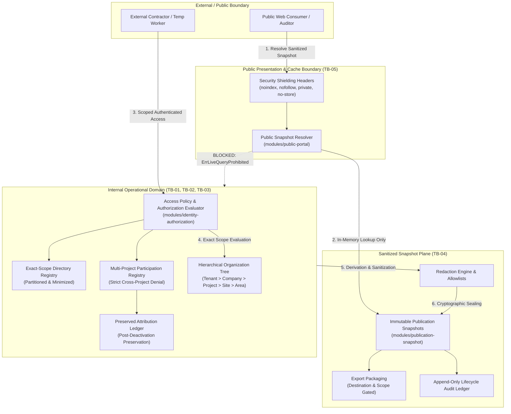

# V0.3 Organization, Party, and Portal Isolation Assurance Case

| Metadata Field | Value |
| :--- | :--- |
| **Document ID** | `DOC-ASSURE-V030-001` |
| **Work Item** | `V030-I033` (GitHub Issue #106) |
| **Lifecycle State** | `DRAFT` |
| **Governing Decisions** | `H030-003`, `H030-004`, `H030-005`, `H030-006`, `H030-007`, `H030-008` |
| **Scope Baseline** | Milestone v0.3.0 Local Synthetic Prework Architecture |
| **Security Risk Classification** | Architecture Assurance & Boundary Control Baseline |

---

## 1. Executive Summary & Purpose

This document provides the authoritative system-context, trust-boundary, and control-evidence-owner assurance case for multi-tenant and multi-party isolation in the OSHE Platform for Milestone v0.3.0. 

The primary objective is to demonstrate that tenant data, organizational structures, party contexts, scoped directory projections, operational records, and public presentation views remain strictly segregated, tamper-evident, and protected against unauthorized lateral movement, privilege escalation, cross-tenant leakage, directory enumeration, or live query bypass.

### Explicit Boundary & Non-Claims Declaration
In strict compliance with approved Sole Human Owner decisions (`H030-003` through `H030-008`), all mechanisms detailed herein operate exclusively as local, in-memory synthetic models and automated qualification test fixtures (`usr_*`, `prj_*`, `ten_*`, `snp_*`). 

**No operational authority, live cloud infrastructure, or production claims are enacted:**
- **Zero Live Public Routes:** No public DNS records, reverse proxies, ingress routes, or live internet endpoints are established (`H030-006`, `H030-007`).
- **Zero CDN Edge Deployment:** No public edge caches, Cloudflare workers, or cloud distribution networks are activated (`H030-007`).
- **Zero Production Persistence:** No production database engines, relational schemas, or live transactional tables are provisioned; operational data stores remain simulated in memory (`H030-008`).
- **Zero Real Identity Provider (IdP) Sync:** No external SAML, OIDC, Active Directory, or OAuth identity providers are integrated; identity remains synthetic (`H030-004`).
- **Zero Real Customer / Personal Data:** All evaluated data payloads use synthetic identifiers and sanitized dummy content; real PII, biometric data, and credentials are categorically excluded (`H030-005`).
- **Zero Operational Policy Binding:** The least-privilege matrix, separation of duties, and delegation rules serve solely as candidate engineering prework and do not constitute final sovereign policy selection (`H030-003`).

---

## 2. System Context & Architecture Overview

The OSHE Platform v0.3.0 architecture segregates core domain capabilities across discrete, dependency-controlled modules operating under strict default-deny boundaries.

### Architectural Subsystems Covered
1. **`MOD-ORG` (Organization & Hierarchy Subsystem):** Enforces strict tenant containment across hierarchical organizational units (`Tenant` > `Company` > `Project` > `Site` > `Area`).
2. **`MOD-IAM` (Identity, Directory & Authorization Subsystem):** Manages synthetic subjects (`usr_*`), high-entropy session tokens (`oshe_tok_<64-hex>`), append-only revocation registries, descriptive directory profiles, least-privilege role matrix, separation-of-duties (SOD) rules, bounded delegations, external user access conditions, multi-project participations, and historical actor attribution.
3. **`MOD-PUB` (Publication Snapshot & Public Portal Subsystem):** Enforces provenance anchoring, approved-field allowlists, deny-by-default redaction, reviewer cryptographic approval evidence, composite integrity signatures, export package scoping, deterministic publication lifecycle states (`DRAFT` -> `UNDER_REVIEW` -> `APPROVED` -> `PUBLISHED_IMMUTABLE`), and local public snapshot resolution with HTTP security shielding.

### System Context & Isolation Boundaries Diagram



---

## 3. End-to-End Data-Flow Narrative

The operational lifecycle of data within OSHE Platform moves across six distinct isolation checkpoints, from synthetic ingestion to public presentation:

### Stage 1: Identity & Scoped Credential Issuance
- Synthetic subjects (`usr_*`) are enrolled under active tenant scopes (`ten_*`).
- High-entropy bearer tokens (`oshe_tok_<64-hex>`) are issued in memory and hashed via SHA-256 before storage; raw secrets are never retained or logged.
- Real-time token status is verified against the `SessionRevocationRegistry`. Targeted session revocations, subject invalidations, and policy generation increments take immediate effect.

### Stage 2: Hierarchical Scope & Role-Based Access Evaluation
- When an operational request is submitted, `AccessEvaluator` asserts valid authentication, active identity lifecycle (`IdentityActive`), and exact tenant matching (`TenantID`).
- Authorization validates that the caller holds active permissions mapped through the least-privilege catalog (`RoleTenantAdmin`, `RoleProjectManager`, `RoleInspector`, `RoleAuditor`, `RoleViewer`, `RoleContractor`, `RoleSupport`).
- Requests targeting mismatched tenants fail closed with `DenialReasonCrossTenant`. Requests targeting unassigned projects fail closed with `DenialReasonScopeMismatch`. Direct-object IDOR attempts fail closed with `DenialReasonDirectObjectMismatch`. Archived records fail closed with `DenialReasonArchivedRecord`.

### Stage 3: Directory Profile Projection & Scoped Discovery
- Directory profiles (`DirectoryProfile`) serve as descriptive structural projections only. They convey zero operational authorization (`AssertNoAuthorizationBypass`).
- Profile identifiers within tenant scopes enforce duplicate collision rejection (`ErrDuplicateIdentifierCollision`).
- Distinct subjects can never be merged, aliased, or consolidated (`AssertNoFalseMerge`, `ErrFalseMergeProhibited`). Structural identifiers (`ProfileID`, `Subject`, `TenantID`, `ProjectID`) are permanently immutable.
- Directory searches are strictly partitioned by the caller's assigned `ProjectID`. Queries across projects or unassigned contexts return empty result sets (`[]MinimizedDirectoryProfile{}`) with a `nil` error (`NEG-V030-04`), preventing organizational reconnaissance or peer contractor discovery.

### Stage 4: External User Access Conditions & Multi-Project Participation
- External users (`CONTRACTOR_WORKER`, `TEMPORARY_WORKER`, `EXTERNAL_AUDITOR`) require an internal sponsor manager (`usr_*`). Self-sponsorship and external sponsors are rejected (`ErrInvalidInternalSponsor`).
- External profiles strictly reject personal PII (emails, phone numbers, national IDs, passports) via `ErrPIIDetected`.
- Initial access conditions are capped at 14 days; renewal extensions are capped at 7 days and require sponsor approval (`ErrRenewalDurationExceeded`).
- Sponsor changes and renewals increment the condition `Generation` counter; sessions presented under older generations immediately fail closed as `CategorySessionStale`.
- A worker active in multiple projects concurrently (`prj_alpha` as Inspector, `prj_beta` as Contractor) exercises role permissions only within assigned projects. Sibling projects (`prj_gamma`) fail closed with `DenialScopeMismatch`.
- Contractors are barred from company/tenant administration (`ErrCompanyAdminDenied`, `ErrContractorAdminProhibited`), resource deletion, and administrative permissions. Compliance auditors are strictly read-only (`ErrAuditorReadOnlyViolation`).
- When project participation is deactivated, active access ceases immediately (`DenialInactiveMembership`), while past operational records remain permanently preserved and tamper-evident in `AttributionLedger` (`ErrAttributionImmutable`).

### Stage 5: Publication Snapshot Derivation, Redaction & Integrity Sealing
- Derived snapshots anchor provenance to internal source entities (`SourceEntityRef`) and verify source SHA-256 digests. Tenant mismatch fails closed (`ErrSourceMismatch`).
- Payloads are passed through `RedactionEngine` against an explicit `PublicationFieldAllowlist`. Unapproved fields are stripped; strict validation rejects unallowlisted keys (`ErrUnapprovedFieldDetected`). Prohibited keywords (`password`, `token`, `secret`, `national_id`) fail immediately (`ErrProhibitedFieldDetected`).
- Publication requires formal reviewer approval (`ReviewerContext`, `ApprovalEvidence`) with cryptographic `DecisionHash`. Approval staleness exceeding 7 days fails closed (`ErrStaleApproval`).
- Integrity is sealed with a canonical key-sorted payload hash (`PayloadDigest`) and composite signature digest (`SignatureDigest`).
- State machine enforces linear transitions (`DRAFT` -> `UNDER_REVIEW` -> `APPROVED` -> `PUBLISHED` -> `EXPIRED`/`WITHDRAWN`/`REPLACED`/`SUPERSEDED`). Withdrawals require mandatory justification. History is preserved in the append-only `LifecycleAuditLedger`.

### Stage 6: Export Packaging & Public Portal Resolution
- Export packages bundle only active `PUBLISHED` snapshots, validate destination scopes (`PUBLIC_PORTAL_PREVIEW`, `EXTERNAL_AUDITOR_PACKAGE`, `REGULATORY_SUBMISSION`), and enforce cross-tenant homogeneity (`ErrCrossTenantAccessDenied`).
- Public consumers query `PublicSnapshotResolver` strictly in memory.
- Any attempt to execute live transactional database queries fails closed immediately with `OPERATIONAL_QUERY_BLOCKED` (`ErrLiveQueryProhibited`).
- Non-existent, wrong-tenant, draft, staged, approved-but-unpublished, withdrawn, or superseded snapshots return generic, non-leaking `NOT_FOUND` (`DenialNotFound`).
- Expired snapshots return `EXPIRED` (`DenialExpired`).
- All public responses mandate HTTP shielding headers (`X-Robots-Tag: noindex, nofollow, noarchive`, `Content-Security-Policy: default-src 'self'`, `Cache-Control: private, no-cache, no-store`) and embed the mandatory `DERIVED_OUTPUT_NON_AUTHORITY` notice.

---

## 4. Trust Boundaries & Threat Analysis

```
+--------------------------------------------------------------------------------------------------+
|                                    TRUST BOUNDARY TAXONOMY                                       |
+----------+-----------------------------------------+---------------------------------------------+
| Boundary | Interface / Segment                     | Primary Threat / Risk                       |
+----------+-----------------------------------------+---------------------------------------------+
| TB-01    | Cross-Tenant Boundary                   | Inter-tenant data leakage or IDOR probing   |
| TB-02    | Intra-Tenant Sibling Scope Boundary     | Lateral reconnaissance across projects/sites|
| TB-03    | Internal vs. External Party Boundary    | Contractor privilege escalation / admin     |
| TB-04    | Operational vs. Public Snapshot Plane   | Operational SQL query injection / bypass    |
| TB-05    | Cache, Search Engine & Network Boundary | Public indexing, search scraping, edge leak |
| TB-06    | Export & Third-Party Package Boundary   | Unauthorized distribution / bundle mixing   |
| TB-07    | Diagnostic Support Boundary             | Persistent support backdoor / mutation      |
+----------+-----------------------------------------+---------------------------------------------+
```

### TB-01: Cross-Tenant Boundary (Tenant Isolation)
- **Threat:** Malicious tenant attempting to read, update, or enumerate records belonging to another tenant via API manipulation or shared storage.
- **Defense:** Strict multi-tenant key prefixes (`tenantID:recordID`), default-deny evaluation in `AccessEvaluator`, cross-tenant source entity rejection (`ErrSourceMismatch`), and isolated ledger queries (`GetHistory`) returning empty sets for mismatched tenants.

### TB-02: Intra-Tenant Sibling Scope Boundary (Project/Site/Area Partitioning)
- **Threat:** Inspector or Contractor assigned to Project Alpha attempting to discover, inspect, or tamper with assets in Project Beta.
- **Defense:** Exact-scope directory partitioning (`DirectoryRegistry`), anti-enumeration return of empty lists (`NEG-V030-04`), multi-project participation isolation (`multi_project_participation.go`), and typed `DenialReasonScopeMismatch`.

### TB-03: Internal vs. External Party Boundary (Contractor & Auditor Restrictions)
- **Threat:** External contractor or temporary worker escalating privileges to Tenant Administrator or Project Manager; compliance auditor executing mutating actions.
- **Defense:** Static role barriers (`AssertNoCompanyAdministration`, `AssertContractorAdminBounds`), auditor read-only enforcement (`AssertAuditorReadOnly`), mandatory internal sponsors (`usr_*`), 7-day renewal ceilings, and generation-based stale-session invalidation.

### TB-04: Operational Data Plane vs. Public Portal Snapshot Plane
- **Threat:** Public portal caller attempting to execute live transactional SQL queries, join operational tables, or access unpublished drafts.
- **Defense:** Standalone public resolver (`public_snapshot_resolver.go`) that serves only pre-registered `PUBLISHED_IMMUTABLE` snapshots. Explicit operational query interception returning `DenialOperationalQueryBlocked` and `ErrLiveQueryProhibited` (`NEG-SNAP-01`).

### TB-05: Cache, Search Engine & Network Boundary
- **Threat:** Search engines indexing public snapshot previews, public edge CDN caching sensitive audit summaries, or client browsers caching stale compliance records.
- **Defense:** Mandatory emission of `X-Robots-Tag: noindex, nofollow, noarchive`, `Content-Security-Policy: default-src 'self'`, and `Cache-Control: private, no-cache, no-store` on every public response (`NEG-SNAP-05`).

### TB-06: Export & Third-Party Package Boundary
- **Threat:** Exporting unvetted draft snapshots, bundling records across multiple tenants into an auditor archive, or exporting to unapproved distribution scopes.
- **Defense:** `ExportPackage` validation rejecting unapproved destinations (`ErrUnapprovedDestinationScope`), rejecting unpublished/superseded records (`ErrUnpublishedSnapshotInExport`), and asserting tenant consistency (`ErrCrossTenantAccessDenied`).

### TB-07: Diagnostic Support Boundary
- **Threat:** Vendor support role persisting indefinitely, mutating tenant data, or exporting confidential compliance archives.
- **Defense:** `RoleSupport` is strictly read-only (mutating actions and export fail closed), bounded to `PROJECT`/`SITE` scopes, and capped at a maximum delegation duration of 3 days (`MaxDelegationDays = 3`).

---

## 5. Prevention, Detection, Test, Evidence & Owner Control Matrix

| Control ID | Trust Boundary | Threat / Risk Scenario | Prevention Mechanism | Detection / Audit Mechanism | Qualification Test Suite | Evidence Artifact | Functional Owner |
| :--- | :--- | :--- | :--- | :--- | :--- | :--- | :--- |
| **`CTRL-ISO-01`** | `TB-01` | Cross-tenant data access or resource probing | `AccessEvaluator` enforces tenant equality; cross-tenant references fail closed (`DenialReasonCrossTenant`). | Real-time security event logging; tenant mismatch audit events. | `TestNegativeControl_CrossTenantMismatch`, `TestNegativeControl_WrongTenant_Isolation` | `identity-authorization`, `public-portal` test logs | Security & Privacy Lead (`w9:p13`) |
| **`CTRL-ISO-02`** | `TB-02` | Project reconnaissance & sibling worker enumeration | Query partitioned by caller project; out-of-scope queries return empty slices (`[]`) with `nil` error (`NEG-V030-04`). | Non-leaking `DenialReasonScopeMismatch` without revealing entity existence. | `TestNegativeControl_NEG_V030_04_CrossProjectDirectoryEnumeration` | Directory qualification report | Data Protection Officer (`w9:p17`) |
| **`CTRL-ISO-03`** | `TB-01`, `TB-02` | Profile collision, identity consolidation, or false merge | Uniqueness of `ProfileID` per tenant; subjects are permanently immutable; false-merge strictly rejected (`AssertNoFalseMerge`). | `DirectoryResolutionLedger` records immutable lifecycle audit entries. | `TestNegativeControl_NEG_V030_05_DuplicateCollisionAndFalseMerge` | Directory resolution qualification suite | Engineering & Systems Lead (`w9:p14`) |
| **`CTRL-ISO-04`** | `TB-03` | Segregation of Duties (SOD) conflict & privilege escalation | Dynamic conflict engine rejecting overlapping incompatible assignments (`SOD-01` to `SOD-05`). | Sovereign authority catalog (`RoleTenantAdmin`) marked non-delegable. | `TestNegativeControl_NEG_V030_09_SegregationOfDutiesConflictDenial` | Authorization matrix test logs | Compliance & Regulatory Lead (`w9:p15`) |
| **`CTRL-ISO-05`** | `TB-03`, `TB-07` | Multi-hop delegation chains & emergency break-glass bypass | `MaxDelegationChainDepth = 1`; self-delegation forbidden; emergency access bypass fails closed (`ErrEmergencyAccessDenied`). | Append-only `DelegationLedger` recording all delegation grants and revocations. | `TestNegativeControl_NEG_V030_07_EmergencyBreakGlassDenial`, `TestNegativeControl_NEG_V030_08_DelegationScopeEscalationDenial` | Delegation control qualification suite | Security & Privacy Lead (`w9:p13`) |
| **`CTRL-ISO-06`** | `TB-03` | External user unauthorized onboarding & excessive validity | Mandatory internal sponsor (`usr_*`); 14-day initial access ceiling; 7-day renewal extension ceiling (`MaxRenewalExtension`). | `ExternalUserLedger` and `AccessConditionLedger` capture sponsor attribution. | `TestQualification_ExternalUser_TemporalExpiryAndRevocation`, `TestNegativeControl_AccessCondition_ExcessiveDuration` | External user qualification suite | Safety & Operations Lead (`w9:p16`) |
| **`CTRL-ISO-07`** | `TB-03` | Stale session reuse after sponsor change or condition renewal | Renewal or sponsor change increments `Generation`; older token generations fail closed (`CategorySessionStale`). | `SessionRevocationRegistry` invalidates older session generations. | `TestQualification_ExternalUser_RenewalAndSponsorChangeGeneration`, `TestNegativeControl_AccessCondition_SponsorChangeImmediateEffect` | Identity session test logs | Security & Privacy Lead (`w9:p13`) |
| **`CTRL-ISO-08`** | `TB-03` | Contractor administrative escalation & auditor mutation | Contractors barred from admin roles, delete actions, and admin permissions; auditors strictly read-only. | Static type and permission assertions (`AssertContractorAdminBounds`, `AssertAuditorReadOnly`). | `TestQualification_ExternalUser_ContractorAndAuditorBoundaries` | Multi-project participation test logs | Quality & Test Assurance Lead (`w9:p18`) |
| **`CTRL-ISO-09`** | `TB-03` | Repudiation of past actions or historical data loss on deactivation | Deactivation ceases operational access immediately (`DenialInactiveMembership`); historical records preserved. | `AttributionLedger` records immutable chronological entries; rejects overwrites (`ErrAttributionImmutable`). | `TestQualification_ExternalUser_DeactivationAndHistoricalAttribution` | Attribution ledger test logs | Product Management (`w9:p2A`) |
| **`CTRL-ISO-10`** | `TB-03`, `TB-05` | Trusted-device claims, offline leakage & profile PII | Mandatory online-only access (`ErrTrustedDeviceProhibited`); regex PII detection rejects emails, phones, national IDs. | Profile validation engine returns typed `ErrPIIDetected`. | `TestQualification_ExternalUser_OnlineOnlyAndProfileMinimization` | Privacy & minimization test logs | Data Protection Officer (`w9:p17`) |
| **`CTRL-ISO-11`** | `TB-04` | Internal sensitive data leakage in public snapshots | Deny-by-default allowlist transformation; prohibited keywords (`password`, `token`, `secret`) purged. | `RedactionEngine` fails closed in strict mode (`ErrUnapprovedFieldDetected`). | `TestNegativeControl_NEG_SNAP_01`, `TestNegativeControl_NEG_SNAP_02` | Redaction engine test logs | Product Management (`w9:p2A`) |
| **`CTRL-ISO-12`** | `TB-04` | Out-of-band tampering or payload desynchronization | Canonical key-sorted SHA-256 payload digest and composite signature digest sealing snapshot envelopes. | `VerifyIntegrity()` validates stored digest against in-memory payload calculation. | `TestNegativeControl_NEG_SNAP_04` | Snapshot integrity test logs | Engineering & Systems Lead (`w9:p14`) |
| **`CTRL-ISO-13`** | `TB-04` | Publishing stale, unapproved, or retracted snapshots | State machine allows only `PUBLISHED_IMMUTABLE`; approvals > 7 days rejected (`ErrStaleApproval`). | Append-only `LifecycleAuditLedger` records state changes with SHA-256 digests. | `TestNegativeControl_NEG_LIFE_01_UnauthorizedPublish`, `TestNegativeControl_NEG_LIFE_02_StaleApproval` | Publication lifecycle test suite | Compliance & Regulatory Lead (`w9:p15`) |
| **`CTRL-ISO-14`** | `TB-04` | Live operational SQL query injection through public resolver | Resolver operates strictly on pre-registered in-memory snapshot models; live queries blocked. | Requests with `IsOperationalQuery = true` return `DenialOperationalQueryBlocked` (`ErrLiveQueryProhibited`). | `TestNegativeControl_OperationalQueryBlocked` | Public portal test logs | Security & Privacy Lead (`w9:p13`) |
| **`CTRL-ISO-15`** | `TB-05` | Search engine indexing & intermediate edge proxy caching | All public resolver responses inject `X-Robots-Tag`, `Content-Security-Policy`, and `Cache-Control`. | Header assertion in `PublicResolveResult.ShieldingHeaders`. | `TestNegativeControl_DataMinimization_And_Shielding` | Public portal header tests | Infrastructure & Ops Lead (`w9:p19`) |
| **`CTRL-ISO-16`** | `TB-04`, `TB-05`| Public mistaking derived snapshot for binding operational record | Mandatory `DERIVED_OUTPUT_NON_AUTHORITY` disclaimer embedded in snapshot presentation envelope. | Resolver asserts non-empty `NonAuthorityNotice`. | `TestPublicSnapshot_CreationAndAccessors` | Snapshot specification tests | Legal & Risk Lead (`w9:p20`) |
| **`CTRL-ISO-17`** | `TB-06` | Cross-tenant bundle mixing or draft leakage in exports | `NewExportPackage` restricts exports to active `PUBLISHED` snapshots under a single matching `TenantID`. | Scope validator verifies destination against approved registry (`PUBLIC_PORTAL_PREVIEW`, etc.). | `TestNegativeControl_NEG_SNAP_06` | Export package qualification tests | Compliance & Regulatory Lead (`w9:p15`) |
| **`CTRL-ISO-18`** | `TB-07` | Vendor support backdoor persistence or data modification | `RoleSupport` is bounded to `PROJECT`/`SITE`, strictly read-only (zero mutation/export), and capped at 3 days. | Access evaluator rejects mutating actions (`ActionCreate`, `ActionUpdate`, `ActionDelete`, `ActionExport`). | `TestNegativeControl_SupportAccessDenial` | Authorization test logs | Security & Privacy Lead (`w9:p13`) |

---

## 6. Governance Gates, Held Decisions & Non-Claims Invariant

The controls documented in this assurance case are governed under the following explicit Human Owner decisions:

```
+----------------------------------------------------------------------------------------------------+
|                                    HELD DECISION REGISTRY                                          |
+----------+------------------------------------------------+-----------------+----------------------+
| Decision | Subject / Scope                                | Current State   | Operational Bound    |
+----------+------------------------------------------------+-----------------+----------------------+
| H030-003 | Authorization Matrix & Role Catalog            | PREWORK_HELD    | In-memory simulation |
| H030-004 | External User Synthetic Models & Lifecycles    | PREWORK_HELD    | Local fixtures only  |
| H030-005 | Directory Scoped Visibility & Anti-Enumeration | PREWORK_HELD    | Local fixtures only  |
| H030-006 | Public Portal Staging & Snapshot Publication   | PREWORK_HELD    | In-memory resolver   |
| H030-007 | Public Network Routes, DNS & CDN Distribution  | PROHIBITED_HELD | Zero live networking |
| H030-008 | Production Database Schemas & Cloud Deployment | PROHIBITED_HELD | Zero persistence     |
+----------+------------------------------------------------+-----------------+----------------------+
```

### Invariant Non-Claims Summary
1. **No Production Public Endpoints:** No HTTP, HTTPS, gRPC, or WebSocket endpoints are opened to the public internet.
2. **No CDN Edge Caching:** No Cloudflare, Fastly, CloudFront, or intermediate proxy distribution layers are configured or active.
3. **No Persistent Production Database:** All state resides purely in thread-safe, local in-memory structures (`map[string]PublicSnapshot`, `map[string]DirectoryProfile`).
4. **No Real Customer Data or PII:** Zero production, customer, or actual workforce personal data is stored, handled, or referenced.
5. **No Operational Authority or Policy Binding:** All models constitute candidate engineering specifications for review and verification; sovereign human authority remains reserved to the Human Project Owner.

---

## 7. Verification & Assurance Conclusion

Through the implementation of default-deny authorization, strict tenant matching, exact-scope directory partitioning, bounded external user lifecycles, contractor admin prohibitions, auditor read-only invariants, post-deactivation historical preservation, deny-by-default redaction, cryptographic integrity seals, operational query blocking, and mandatory search-engine shielding headers, the OSHE Platform v0.3.0 establishes a comprehensive, defense-in-depth isolation posture.

All verification tests pass cleanly within the candidate engineering test suite, providing full architectural assurance without violating any held human governance gates or operational non-claims.
