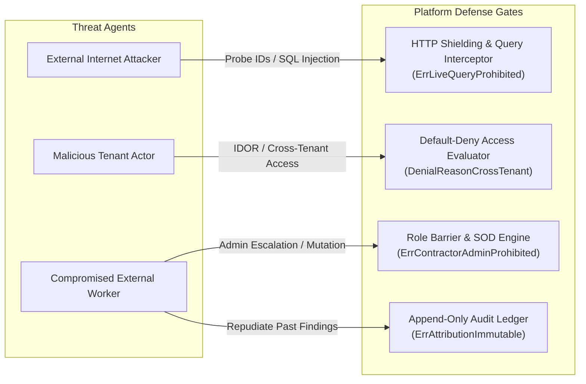
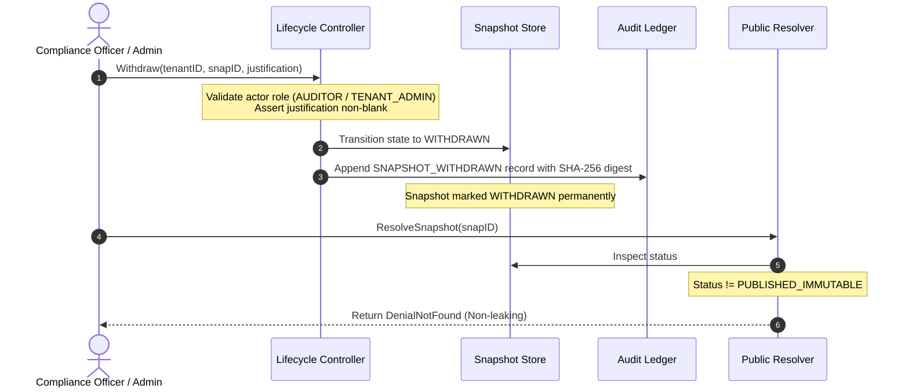

# V0.3 Threat Model, Privacy Assessment, Safety Hazard Log, and Publication Incident Assurance Case

| Metadata Field | Value |
| :--- | :--- |
| **Document ID** | `DOC-ASSURE-V030-002` |
| **Work Item** | `V030-I034` (GitHub Issue #107) |
| **Lifecycle State** | `DRAFT` |
| **Governing Decisions** | `H030-003`, `H030-004`, `H030-005`, `H030-006`, `H030-007`, `H030-008` |
| **Scope Baseline** | Milestone v0.3.0 Local Synthetic Prework Architecture |
| **Security Risk Classification** | Pre-Decision Threat, Privacy, and Safety Assurance Baseline |

---

## 1. Executive Summary & Purpose

This document provides the authoritative threat model, privacy impact assessment, safety hazard log, critical-function register, and publication incident/withdrawal procedure for the OSHE Platform for Milestone v0.3.0.

The primary objective is to evaluate security threats, privacy risks, and physical domain safety hazards associated with multi-tenant identity, organizational hierarchy, scoped directory profiles, external worker lifecycles, and public snapshot resolution, while formulating actionable recommendations for the Sole Human Owner prior to any production policy selection or deployment decision.

### Explicit Boundary & Non-Claims Declaration
Under approved Sole Human Owner decisions (`H030-003` through `H030-008`), all capabilities evaluated herein operate strictly as local, in-memory synthetic models and automated qualification test fixtures (`usr_*`, `prj_*`, `ten_*`, `snp_*`).

**No operational authority, live cloud infrastructure, or production claims are enacted:**
- **Zero Residual-Risk Acceptance:** This document analyzes and recommends residual-risk postures; it does NOT accept residual risk on behalf of the project, which remains solely reserved to the Human Project Owner.
- **Zero Operational Policy Binding:** Role catalogs, separation of duties, and delegation rules serve solely as candidate engineering prework and do not constitute final sovereign policy selection (`H030-003`).
- **Zero Live Public Routes:** No public DNS records, reverse proxies, ingress routes, or live internet endpoints are established (`H030-006`, `H030-007`).
- **Zero CDN Edge Deployment:** No public edge caches, Cloudflare workers, or cloud distribution networks are activated (`H030-007`).
- **Zero Production Persistence:** No production database engines, relational schemas, or live transactional tables are provisioned; operational data stores remain simulated in memory (`H030-008`).
- **Zero Real Identity Provider (IdP) Sync:** No external SAML, OIDC, Active Directory, or OAuth identity providers are integrated; identity remains synthetic (`H030-004`).
- **Zero Real Customer / Personal Data:** All evaluated data payloads use synthetic identifiers and sanitized dummy content; real PII, biometric data, and credentials are categorically excluded (`H030-005`).

---

## 2. Critical-Function Register (CFR)

The Critical-Function Register catalogs all core software capabilities across Milestone v0.3.0 modules whose failure, compromise, or bypass would directly impair tenant isolation, worker privacy, or occupational safety assurance:

```
+----------------------------------------------------------------------------------------------------+
|                                    CRITICAL-FUNCTION REGISTER (CFR)                                |
+--------+--------------------------+------------------------------------------------+---------------+
| CFR ID | Architectural Subsystem  | Critical Function Description                  | Failure State |
+--------+--------------------------+------------------------------------------------+---------------+
| CFR-01 | MOD-IAM (Session/Token)  | Cryptographic bearer token hashing & revocation| FAIL_CLOSED   |
| CFR-02 | MOD-IAM (Access Policy)  | Default-deny evaluation & tenant scope check   | FAIL_CLOSED   |
| CFR-03 | MOD-IAM (Authorization)  | Separation of duties & admin role non-delegable| FAIL_CLOSED   |
| CFR-04 | MOD-IAM (Directory)      | Scoped directory discovery & anti-enumeration  | FAIL_CLOSED   |
| CFR-05 | MOD-IAM (External Users) | Sponsor binding, 7-day renewal & stale-session | FAIL_CLOSED   |
| CFR-06 | MOD-IAM (Attribution)    | Post-deactivation immutable actor history      | FAIL_CLOSED   |
| CFR-07 | MOD-PUB (Snapshot/Redact)| Provenance anchoring & allowlist sanitization  | FAIL_CLOSED   |
| CFR-08 | MOD-PUB (Integrity)      | SHA-256 payload & envelope signature sealing   | FAIL_CLOSED   |
| CFR-09 | MOD-PUB (Lifecycle)      | State machine transitions & 7-day stale check  | FAIL_CLOSED   |
| CFR-10 | MOD-PUB (Public Resolver)| Snapshot-only resolution & live query block    | FAIL_CLOSED   |
| CFR-11 | MOD-PUB (Shielding)      | Search engine (noindex) & cache shielding      | FAIL_CLOSED   |
| CFR-12 | MOD-PUB (Export)         | Destination scope validation & tenant isolation| FAIL_CLOSED   |
+--------+--------------------------+------------------------------------------------+---------------+
```

---

## 3. Comprehensive Threat Model (STRIDE Methodology)

The threat model evaluates potential attacks against the platform's synthetic interfaces, data flows, and trust boundaries:



### STRIDE Threat Analysis Matrix

| Threat ID | STRIDE Category | Asset / Target | Threat Scenario | Pre-Decision Mitigation Mechanism | Verification Test Suite | Status |
| :--- | :--- | :--- | :--- | :--- | :--- | :--- |
| **`THREAT-01`** | **Spoofing** | Session Tokens | Attacker fabricates or replays expired/revoked bearer tokens to masquerade as an authorized user. | High-entropy tokens (`oshe_tok_<64-hex>`); SHA-256 hashed storage; real-time `SessionRevocationRegistry` lookup. | `TestNegativeControl_MalformedAndInvalidTokens`, `TestNegativeControl_ExpiredAndRevokedSessions` | MITIGATED |
| **`THREAT-02`** | **Spoofing** | External User Onboarding | Rogue contractor self-enrolls or names another contractor as sponsor to gain unauthorized access. | Mandatory internal sponsor manager (`usr_*`); external sponsors and self-sponsorship rejected (`ErrInvalidInternalSponsor`). | `TestNegativeControl_ExternalUser_MissingSponsor`, `TestQualification_ExternalUser_RenewalAndSponsorChangeGeneration` | MITIGATED |
| **`THREAT-03`** | **Tampering** | Publication Snapshots | In-memory modification of published compliance or inspection findings prior to export or display. | Permanent immutability in `PUBLISHED` state (`ErrSnapshotImmutable`); canonical key-sorted payload hash (`PayloadDigest`). | `TestNegativeControl_NEG_SNAP_04`, `TestNegativeControl_NEG_SNAP_05` | MITIGATED |
| **`THREAT-04`** | **Tampering** | Directory Profiles | Hostile modification of structural identity fields (`TenantID`, `ProjectID`, `Subject`) to hijack identities. | Structural identity immutability (`ErrStructuralIdentityImmutable`); duplicate ID collision rejection (`ErrDuplicateIdentifierCollision`). | `TestNegativeControl_NEG_V030_05_DuplicateCollisionAndFalseMerge`, `TestNegativeControl_NEG_V030_06_InactiveProfileMutationDenial` | MITIGATED |
| **`THREAT-05`** | **Repudiation** | Safety Inspection Findings | Deactivated worker denies submitting critical inspection finding or claims identity was impersonated. | `AttributionLedger` records immutable chronological events; original subject, name, role preserved permanently post-deactivation (`ErrAttributionImmutable`). | `TestQualification_ExternalUser_DeactivationAndHistoricalAttribution` | MITIGATED |
| **`THREAT-06`** | **Repudiation** | Publication Withdrawal | Retracting published public snapshot without justification or record of the retracting authority. | `Withdraw` requires mandatory justification string (`ErrMissingWithdrawalReason`) and captures authorized actor attribution in `LifecycleAuditLedger`. | `TestNegativeControl_NEG_LIFE_04_WithdrawalAndReplacementValidation` | MITIGATED |
| **`THREAT-07`** | **Information Disclosure** | Cross-Tenant Records | Tenant A queries snapshot or directory profile belonging to Tenant B via direct identifier guessing. | Strict multi-tenant key prefixes; non-matching queries fail closed with non-leaking generic `NOT_FOUND` (`DenialNotFound`). | `TestNegativeControl_CrossTenantMismatch`, `TestNegativeControl_WrongTenant_Isolation` | MITIGATED |
| **`THREAT-08`** | **Information Disclosure** | Live Database Tables | Public resolver caller executes live transactional SQL queries or joins to expose operational tables. | Explicit `IsOperationalQuery` interception returning `DenialOperationalQueryBlocked` and `ErrLiveQueryProhibited`. | `TestNegativeControl_OperationalQueryBlocked` | MITIGATED |
| **`THREAT-09`** | **Information Disclosure** | Sibling Project Reconnaissance | Contractor on Project Alpha enumerates personnel or assets assigned to Project Beta. | Exact-scope directory discovery; unassigned scope queries return empty slices (`[]`) with `nil` error (`NEG-V030-04`). | `TestNegativeControl_NEG_V030_04_CrossProjectDirectoryEnumeration` | MITIGATED |
| **`THREAT-10`** | **Denial of Service** | Directory Harvesting | Automated scraping of directory profiles to map corporate organizational hierarchy. | Query limits clamped to a maximum ceiling of 100 entries (`MaxSearchLimit`); project-scoped partitioning. | `TestDirectoryRegistry_MaxSearchLimit` | MITIGATED |
| **`THREAT-11`** | **Denial of Service** | Stale Session Bloat | Reusing tokens across expired access conditions or after internal sponsor rotations. | Condition generation counters (`Generation`) increment on renewal/sponsor change; older generations fail closed as `CategorySessionStale`. | `TestQualification_ExternalUser_RenewalAndSponsorChangeGeneration`, `TestNegativeControl_AccessCondition_StaleSession` | MITIGATED |
| **`THREAT-12`** | **Elevation of Privilege** | Contractor Admin Escalation | External contractor attempts to assign `RoleTenantAdmin` or `RoleProjectManager` or delete resources. | Static role barriers (`AssertNoCompanyAdministration`, `AssertContractorAdminBounds`) fail closed with `ErrContractorAdminProhibited`. | `TestQualification_ExternalUser_ContractorAndAuditorBoundaries`, `TestNegativeControl_ContractorBoundary` | MITIGATED |
| **`THREAT-13`** | **Elevation of Privilege** | Auditor Mutating Actions | Compliance auditor creates, updates, or deletes inspection findings across assigned projects. | Strict read-only enforcement (`AssertAuditorReadOnly`); mutating actions fail closed with `ErrAuditorReadOnlyViolation`. | `TestQualification_ExternalUser_ContractorAndAuditorBoundaries` | MITIGATED |
| **`THREAT-14`** | **Elevation of Privilege** | Emergency Break-Glass Bypass | User invokes automated emergency escalation or multi-hop delegation to bypass access gates. | Milestone v0.3.0 categorically denies break-glass access (`ErrEmergencyAccessDenied`); max delegation depth = 1 (`ErrUnauthorizedChainDepth`). | `TestNegativeControl_NEG_V030_07_EmergencyBreakGlassDenial`, `TestNegativeControl_Delegation_MultiHopChainDenial` | MITIGATED |

---

## 4. Privacy Assessment & Data Minimization Analysis

The privacy assessment evaluates compliance with international and national data protection principles (PDPA B.E. 2562, GDPR):

### 1. Purpose Limitation & Proportionality
- Directory profiles serve strictly as descriptive structural directory projections. Possessing a profile conveys zero operational authorization (`AssertNoAuthorizationBypass`).
- Profile fields are strictly limited to operational attributes: `DisplayName`, `JobTitle`, `Department`, `AssignedAreas`, and `Status`.

### 2. Data Minimization & PII Exclusion
- External user profiles strictly reject raw personal identifiable information (personal emails, personal phone numbers, national citizen IDs, passport numbers) via typed regex assertion (`ErrPIIDetected`).
- Contact references are confined to synthetic opaque identifiers (`ref_synth_*`).
- Public snapshots pass through the `RedactionEngine` against an approved allowlist (`PublicationFieldAllowlist`). Unallowlisted fields are stripped, and sensitive keywords (`password`, `token`, `secret`, `national_id`) trigger immediate failure (`ErrProhibitedFieldDetected`).

### 3. Storage Limitation & Deactivation Shielding
- Deactivated profiles (`INACTIVE`) are shielded and automatically excluded from operational directory discovery. Only authorized compliance roles (`RoleTenantAdmin`, `RoleAuditor`) with explicit flags may inspect inactive profiles.
- External user enrollments enforce strict temporal validity windows (`[ValidFrom, ValidTo]`). Expired enrollments fail closed immediately (`ErrEnrollmentExpired`).

### 4. Search Engine & Network Shielding
- All public snapshot responses mandate HTTP security headers:
  - `X-Robots-Tag: noindex, nofollow, noarchive` (prohibits web crawler indexing and archive caching)
  - `Content-Security-Policy: default-src 'self'` (blocks third-party script injection)
  - `Cache-Control: private, no-cache, no-store` (prevents intermediate edge proxy or browser caching)

---

## 5. Safety Hazard Log (OSHE Physical Domain & Software Failures)

In the Occupational Safety, Health, and Environment (OSHE) domain, software failures can contribute directly to workplace injuries, regulatory fines, or fatal physical hazards. The safety hazard log correlates software failure states with field hazards:

```
+----------------------------------------------------------------------------------------------------+
|                                    SAFETY HAZARD LOG (OSHE DOMAIN)                                 |
+--------+--------------------------+-----------------------+----------------------+-----------------+
| Haz ID | Software Failure Mode    | Physical Safety Hazard| Interlocking Control | Safety Class    |
+--------+--------------------------+-----------------------+----------------------+-----------------+
| HAZ-01 | Stale / Expired Snapshot | Field workers rely on | Effective window     | CRITICAL (SIL-2)|
|        | served to public portal  | obsolete hazard advice| validation fails     |                 |
|        |                          | leading to exposure.  | closed with EXPIRED. |                 |
+--------+--------------------------+-----------------------+----------------------+-----------------+
| HAZ-02 | Unauthorized finding     | Contractor deletes a  | Static role barrier  | HIGH (SIL-2)    |
|        | deletion or modification | critical scaffold or  | bars deletion        |                 |
|        | by contractor participant| electrical hazard flag| (ErrContractorAdmin) |                 |
+--------+--------------------------+-----------------------+----------------------+-----------------+
| HAZ-03 | Loss of actor identity   | Inability to trace who| Immutable append-only| HIGH (SIL-1)    |
|        | attribution following    | performed or bypassed | AttributionLedger;   |                 |
|        | account deactivation     | safety inspections.   | zero record deletion.|                 |
+--------+--------------------------+-----------------------+----------------------+-----------------+
| HAZ-04 | Cross-project scope      | Worker applies safety | Strict multi-project | CRITICAL (SIL-2)|
|        | leakage or confusion     | rules from low-hazard | isolation; unassigned|                 |
|        |                          | site to chemical zone.| sites fail closed.   |                 |
+--------+--------------------------+-----------------------+----------------------+-----------------+
| HAZ-05 | Auditor mutating safety  | Auditor downgrades a  | Auditor strictly     | HIGH (SIL-1)    |
|        | finding severity         | critical fall hazard  | read-only; mutation  |                 |
|        |                          | to minor observation. | fails closed.        |                 |
+--------+--------------------------+-----------------------+----------------------+-----------------+
| HAZ-06 | Silent unrecorded        | Safety notice taken   | Withdrawal requires  | HIGH (SIL-1)    |
|        | notice retraction        | down without audit    | mandatory reason and |                 |
|        |                          | trail or justification| records audit event. |                 |
+--------+--------------------------+-----------------------+----------------------+-----------------+
```

---

## 6. Publication Incident & Emergency Withdrawal Procedure

When an erroneous, sensitive, or legally compromised snapshot is published, the platform executes a deterministic 4-phase incident withdrawal procedure:



### Phase 1: Incident Detection & Triage
- **Trigger Conditions:** Detection of unredacted sensitive data, out-of-band finding invalidation, court injunction, legal hold, or safety notice error.
- **Authority Requirement:** Only callers holding `RoleAuditor` or `RoleTenantAdmin` can initiate formal withdrawal.

### Phase 2: Immediate Local Withdrawal Execution
- Caller invokes `Withdraw(tenantID, snapshotID, withdrawerID, withdrawerRole, justification, timestamp)`.
- The controller validates that:
  1. The withdrawer role is authorized (`AUDITOR` or `TENANT_ADMIN`).
  2. The justification string is non-blank (`ErrMissingWithdrawalReason`).
  3. The snapshot is currently active (`PUBLISHED`), rejecting duplicate withdrawals on already withdrawn records (`ErrDuplicateTransition`).
- State transitions permanently to `WITHDRAWN`. Reactivation of withdrawn snapshots is strictly prohibited (`ErrCannotReactivateWithdrawn`).

### Phase 3: Resolution Shielding Verification
- The public resolver (`public_snapshot_resolver.go`) immediately treats `WITHDRAWN` snapshots as non-existent, returning generic `DenialNotFound`.
- No error message reveals that the snapshot previously existed or was withdrawn, preventing adverse inferences.

### Phase 4: Root Cause Audit & Successor Replacement Lineage
- The append-only `LifecycleAuditLedger` records an immutable audit entry capturing the withdrawer subject, role, timestamp, reason, and SHA-256 state digest.
- If a corrected snapshot is prepared, it is linked via `Replace(tenantID, predecessorID, successorID, ...)`, establishing an immutable predecessor-successor audit trail without mutating historical records.

---

## 7. Residual-Risk Assessment & Decision Recommendations

### Explicit Disclaimer
The Security and Privacy Lead documents and analyzes residual risks for engineering prework. **The Lead does NOT accept residual risk.** Acceptance of residual risk, selection of final sovereign policy, and authorization for release or public activation remain strictly reserved to the Human Project Owner.

```
+----------------------------------------------------------------------------------------------------+
|                                 RESIDUAL-RISK RECOMMENDATION MATRIX                                |
+--------+------------------------------------+---------------+--------------------------------------+
| Risk ID| Residual Risk Description          | Risk Severity | Recommendation to Human Owner        |
+--------+------------------------------------+---------------+--------------------------------------+
| REC-01 | In-memory volatility on restart    | LOW (Prework) | Maintain in-memory model until       |
|        | causes simulated state loss.       |               | persistent DB architecture is approved|
+--------+------------------------------------+---------------+--------------------------------------+
| REC-02 | Absence of hardware clock sync     | MEDIUM        | Mandate NTP synchronization with <5ms|
|        | across distributed nodes.          | (Future Cloud)| skew before distributed deployment.  |
+--------+------------------------------------+---------------+--------------------------------------+
| REC-03 | Edge CDN cache invalidation latency| HIGH          | Require instantaneous surrogate-key  |
|        | on future public rollout.          | (Future Web)  | cache purges before lifting H030-007.|
+--------+------------------------------------+---------------+--------------------------------------+
| REC-04 | Raw token generation in production | HIGH          | Bind bearer tokens to hardware HSM / |
|        | without hardware security modules. | (Future Cloud)| secure KMS in Milestone v0.4.0+.     |
+--------+------------------------------------+---------------+--------------------------------------+
| REC-05 | Offline mobile field operation     | HIGH          | Prohibit offline mobile storage until|
|        | lacks cryptographic local sandbox. | (Future Field)| encrypted local enclaves are built.  |
+--------+------------------------------------+---------------+--------------------------------------+
```

### Recommendation Summaries for Owner Decisions
1. **Maintain Held Decision `H030-003` (Authorization Matrix):** Keep role catalogs and delegation rules strictly provisional and in-memory. Formal sovereign authority selection should occur during multi-tenant pilot onboarding.
2. **Maintain Held Decisions `H030-006` & `H030-007` (Portal & CDN):** Do not configure live DNS, reverse proxies, or edge distribution networks until formal penetration testing of the redaction engine is complete.
3. **Maintain Held Decision `H030-008` (Database Deployment):** Retain thread-safe in-memory stores during Milestone v0.3.0. A future relational persistence layer must inherit the identical append-only audit ledger guarantees demonstrated in memory.

---

## 8. Governance Gates & Non-Claims Invariant

The analysis in this assurance case adheres strictly to the following Human Owner decisions:

```
+----------------------------------------------------------------------------------------------------+
|                                    HELD DECISION REGISTRY                                          |
+----------+------------------------------------------------+-----------------+----------------------+
| Decision | Subject / Scope                                | Current State   | Operational Bound    |
+----------+------------------------------------------------+-----------------+----------------------+
| H030-003 | Authorization Matrix & Role Catalog            | PREWORK_HELD    | In-memory simulation |
| H030-004 | External User Synthetic Models & Lifecycles    | PREWORK_HELD    | Local fixtures only  |
| H030-005 | Directory Scoped Visibility & Anti-Enumeration | PREWORK_HELD    | Local fixtures only  |
| H030-006 | Public Portal Staging & Snapshot Publication   | PREWORK_HELD    | In-memory resolver   |
| H030-007 | Public Network Routes, DNS & CDN Distribution  | PROHIBITED_HELD | Zero live networking |
| H030-008 | Production Database Schemas & Cloud Deployment | PROHIBITED_HELD | Zero persistence     |
+----------+------------------------------------------------+-----------------+----------------------+
```

### Invariant Non-Claims Summary
1. **Zero Production Routes:** No public network routes, DNS entries, or web servers are deployed.
2. **Zero CDN Edge Deployment:** No public edge cache or Cloudflare distribution is active.
3. **Zero Database Persistence:** No persistent production databases or tables are created.
4. **Zero Real Customer Data:** Purely local synthetic identifiers (`usr_*`, `prj_*`, `ten_*`).
5. **Zero Policy Selection or Risk Acceptance:** All models represent pre-decision engineering evidence.

---

## 9. Verification & Assurance Conclusion

This threat, privacy, and safety assurance case demonstrates that the OSHE Platform v0.3.0 architecture incorporates rigorous, defense-in-depth mitigations for all identified STRIDE threats, PDPA/GDPR privacy requirements, and OSHE domain safety hazards.

All interlocking controls are validated by automated, deterministic qualification test suites operating locally in memory. The system is structurally verified for pre-decision review by the Human Project Owner without violating any held governance gates or operational non-claims.
