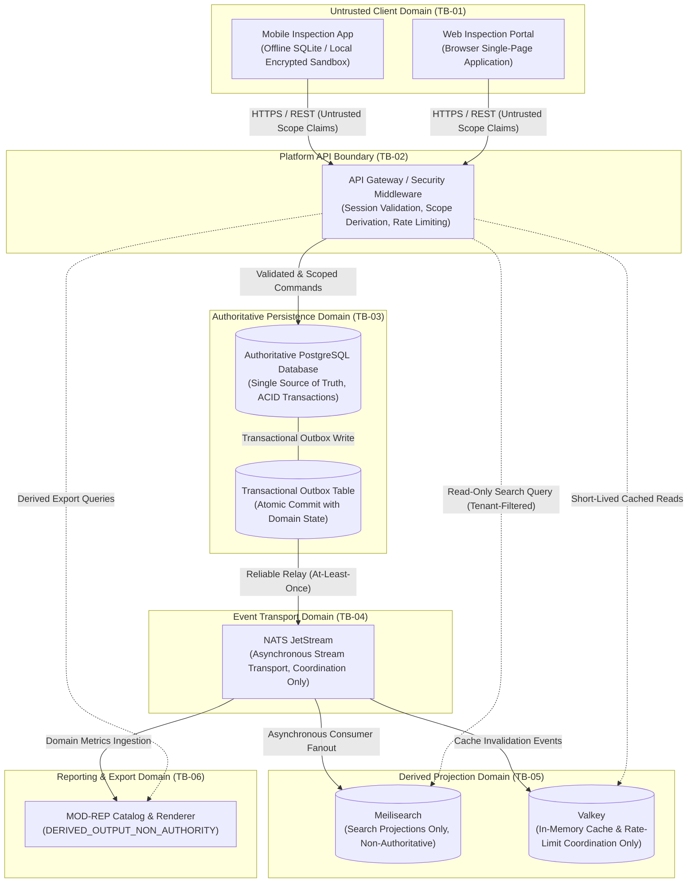

# v0.4.0 System Context, Trust Boundaries, and Safety Assurance Case

| Metadata Field | Value |
| :--- | :--- |
| **Document ID** | `DOC-ASSURE-V040-001` |
| **Work Item** | `V040-I033` (GitHub Issue #144) |
| **Lifecycle State** | `DRAFT_STATIC_ASSURANCE_CASE` |
| **Planning Status** | `PLANNING_ONLY` |
| **Governing Decisions** | `HDEC-V040-FOUNDATION-054`, `HDEC-V040-SCORING-058`, `H040-001`..`H040-006` Approved / `H040-007`..`H040-011` HOLD |
| **Target Milestone** | `v0.4.0 - OSHE Inspect Private Alpha` |
| **Security Risk Classification** | Architecture Assurance & Boundary Control Baseline |

---

## 1. Executive Summary & Purpose

This document establishes the bounded, static system-context, trust-boundary, and safety-assurance case for Milestone `v0.4.0 OSHE Inspect Private Alpha` under Issue #144 (`V040-I033`).

The primary objective is to define the authoritative architectural boundaries, data-flow directions, trust domains, and control matrices governing operational inspections, hazard identification, corrective and preventive actions (CAPA), evidence integrity, mobile offline synchronization, and derived reporting.

### Explicit Boundary, Non-Claims, and Non-Activation Declaration
In strict adherence to approved Sole Human Owner foundation decisions **HDEC-V040-FOUNDATION-054** and **HDEC-V040-SCORING-058**:
- **Planning-Only Status:** This document is an authoritative engineering architecture specification and planning baseline. It operates strictly under lifecycle state `DRAFT_STATIC_ASSURANCE_CASE`.
- **Zero Runtime Claims:** This static assurance case makes no claims of live runtime deployment, system uptime, SLA, or execution availability.
- **Zero Security Certification Claims:** No external ISO, SOC 2, or regulatory security certification is asserted or implied.
- **Zero Regulatory Compliance Claims:** No statutory safety or legal compliance certification is granted.
- **No Schema, Service, Container, Event Contract, or Activation:** This static record creates **no database schema, migration, microservice, container configuration, broker event contract, external route, or infrastructure activation**. All such implementations remain separately leased, developed, and reviewed under human governance.
- **Retained Foundation Holds:** Foundation holds `H040-007` through `H040-011` remain strictly on `HOLD`. Zero authority is granted to alter or lift these holds.

---

## 2. System Context & Architecture Overview

The OSHE Platform v0.4.0 Private Alpha architecture establishes a deterministic, modular core for safety inspection workflows, structured findings tracking, evidence custody, offline-first field capture, and non-authoritative reporting projections.

### Architectural Subsystems and Domain Modules

1. **`MOD-WFA` (Workflow & Inspection Action Subsystem):**
   - Coordinates authoritative inspection lifecycles (`DRAFT` $\to$ `IN_PROGRESS` $\to$ `UNDER_REVIEW` $\to$ `APPROVED` $\to$ `CLOSED`).
   - Executes deterministic operational compliance scoring under **HDEC-V040-SCORING-058** (`MODEL_2_WEIGHTED`, `U1_QUARANTINE_DENOMINATOR`, `R1_ROUND_HALF_UP`, `CF1_PRIORITY_FLAG`, 80.00% / 8000 bps passing threshold).
   - Enforces fail-closed governance (`critical > UNKNOWN > score`), unconditional manual override denial under deferred Gate `H040-004`, and autonomous AI boundary enforcement.
2. **`MOD-EVD` (Evidence Integrity & Capture Subsystem):**
   - Manages cryptographic SHA-256 content-addressable evidence references (photos, documents, scan observations).
   - Enforces tamper-evident bundle binding and immutable linkage to inspection items and findings.
3. **`MOD-CAPA` (Finding & Corrective Action Subsystem):**
   - Manages finding triage, critical severity flags, corrective action assignments, remediation verification, and re-inspection closure.
4. **`MOD-OFF` (Mobile Offline & Conflict Resolution Subsystem):**
   - Manages local client draft staging in encrypted sandbox storage.
   - Enforces provisional-only offline state; changes become authoritative only upon server-side conflict detection and transactional PostgreSQL commit.
5. **`MOD-REP` (Controlled Reporting & Localization Subsystem):**
   - Houses reporting query catalogs, operational dashboard aggregations, and export renderers.
   - Enforces the mandatory `DERIVED_OUTPUT_NON_AUTHORITY` notice across all metrics, reports, and exports.
6. **`MOD-ORG` & `MOD-IAM` (Hierarchy & Authorization Subsystem):**
   - Enforces multi-tenant isolation, organizational hierarchies (`Tenant` $\to$ `Company` $\to$ `Project` $\to$ `Site` $\to$ `Area`), role matrices, and least-privilege access rules.
7. **`MOD-PORTAL` (Standalone Inspect Composition Subsystem):**
   - Composes user-facing navigation, forms, and views while maintaining strict client-side untrusted boundaries.

### System Context Diagram

---

## 3. Data-Flow and Trust Boundaries

The platform architecture segregates components into discrete trust domains to prevent data tampering, lateral privilege escalation, and projection desynchronization.

### Core Data-Flow Invariants

1. **Authoritative PostgreSQL (Single Source of Truth):**
   - PostgreSQL is the **sole authoritative persistence engine** for all operational entities (checklists, inspection records, findings, corrective actions, evidence metadata, scores, and organization structures).
   - Direct database writes occur exclusively through transactional command handlers operating under ACID guarantees.
   - External clients, projection services, and reporting subsystems have zero direct write authority to PostgreSQL tables.

2. **Transactional Outbox Pattern:**
   - Domain mutations commit state changes and corresponding event records atomically within the same PostgreSQL transaction.
   - This eliminates dual-write hazards and ensures zero data loss between operational state transitions and downstream messaging.

3. **NATS JetStream (Transport and Coordination Only):**
   - NATS JetStream serves strictly as an asynchronous event streaming backbone.
   - JetStream is **never an authoritative record store**. Messages are transient event notifications used to trigger projection updates, cache invalidation, and asynchronous audit recording.
   - Message consumers are idempotent to safely accommodate at-least-once delivery semantics.

4. **Meilisearch (Projection-Only):**
   - Meilisearch stores locale-aware, tokenized text search projections derived exclusively from outbox event streams.
   - Meilisearch is **strictly projection-only**; it is never an operational source of truth.
   - API endpoints querying Meilisearch apply mandatory server-side tenant, site, classification, and authorization filters before returning results.
   - In the event of Meilisearch index corruption, partition, or drift, the search index is completely wiped and rebuilt from authoritative PostgreSQL state through transactional-outbox event replay.

5. **Valkey (Cache-Only):**
   - Valkey provides low-latency caching, API rate-limiting buckets, and ephemeral distributed coordination.
   - Valkey is **strictly cache-only**; it never stores authoritative business state.
   - Any cache miss, eviction, or server restart falls back gracefully to PostgreSQL. Direct alteration of authoritative data via cache writes is strictly prohibited.

6. **Failed Projection Rebuilding:**
   - A failure, desynchronization, or crash of Meilisearch or Valkey does not affect operational transaction processing in PostgreSQL.
   - Recovery is achieved exclusively through deterministic replay from PostgreSQL via outbox logs.

---

## 4. Untrusted Client Scopes & Default-Deny Boundaries

### Untrusted Client-Supplied Scope Claims
All client inputs—including parameters submitted in request headers, query strings, and JSON payloads—are treated as **inherently untrusted**. Specifically:
- **`tenant_id` Claims:** Clients cannot assert or switch tenant contexts arbitrarily. The effective tenant context is derived strictly from verified, cryptographically signed authentication credentials.
- **`project_id` & `site_id` Claims:** The user's permission to interact with a specific project or site is validated server-side against active assignments in PostgreSQL.
- **Role and Permission Claims:** Client assertions of administrative, supervisory, or inspector roles are ignored. Authorized permissions are resolved server-side per request.
- **Timestamp Claims:** Client-submitted creation or modification timestamps are treated as unverified hints; authoritative event sequencing relies on monotonic server clocks and audit ledger sequence counters.

### Default-Deny Access Policy
- Every request without valid, unexpired credentials and explicit authorization is denied with HTTP 401 (Unauthorized) or HTTP 403 (Forbidden).
- Missing, malformed, or out-of-scope parameters trigger immediate fail-closed rejection with stable denial error codes (`BLANK_IDENTIFIER`, `UNAUTHORIZED_ACTOR_CLASS`, `INVALID_CATALOG_TRANSITION`).

---

## 5. Discrete Multi-Dimensional Isolation Boundaries

| Boundary Domain | Boundary Identifier | Isolation Mechanism & Enforcement Rules |
| :--- | :--- | :--- |
| **Tenant Boundary** | `TB-TENANT` | Strict relational partitioning by `tenant_id`. Database queries require hardcoded tenant filtering; cross-tenant references fail closed (`ErrCrossTenantRecord`, `ErrUnauthorizedReader`). Zero cross-tenant data leakage permitted. |
| **Project Boundary** | `TB-PROJECT` | Hierarchical scoping (`Tenant` $\to$ `Company` $\to$ `Project`). Users access inspections and findings only within projects where active participation is explicitly mapped. |
| **Site / Area Boundary** | `TB-SITE` | Physical location zoning. Inspections and equipment checklists are pinned to specific sites and areas (`SiteID`, `AreaID`). Mobile client GPS metadata is recorded for audit verification but cannot override site assignment. |
| **Contractor Boundary** | `TB-CONTRACTOR` | External third-party contractor personnel are restricted to assigned corrective actions and findings. Contractor accounts are prohibited from browsing general tenant directories, unrelated checklists, or executive analytics. |
| **Evidence Boundary** | `TB-EVIDENCE` | Media files and documents are stored in content-addressable storage hashed with SHA-256. Stored evidence files are immutable. Database records store only hashes and validated metadata; raw evidence replacement is impossible. |
| **Offline Boundary** | `TB-OFFLINE` | Local mobile drafts reside in encrypted sandbox storage (`MOD-OFF`). Offline drafts carry provisional status only. Conflicts are detected on sync; server-side reconciliation in PostgreSQL is required for authoritative state change. |
| **Report Boundary** | `TB-REPORT` | Operational metrics and analytics in `MOD-REP` are derived projections. All outputs carry mandatory header `DERIVED_OUTPUT_NON_AUTHORITY`. Direct state mutation via reporting endpoints is prohibited. |
| **Export Boundary** | `TB-EXPORT` | Complete-record exports require authorization and produce a `GenerationManifest` containing dual cryptographic digests (`SourceDataDigest` and `RenderedDigest`). Tampering invalidates manifest integrity. |

---

## 6. Prevention, Detection, Evidence, and Owner (PDEO) Matrix

| Domain | Threat / Risk Vector | Prevention Mechanism | Detection Mechanism | Evidence Artifact | Governed Owner |
| :--- | :--- | :--- | :--- | :--- | :--- |
| **Tenant Isolation** | Cross-tenant data exfiltration via manipulated query parameter | Tenant context derived exclusively from verified session; hardcoded `tenant_id` filter on all PostgreSQL queries | Real-time query assertion interceptors; automated cross-tenant penetration tests | Test suite `TestCrossTenantDenial`, `TestReportRenderer_TenantValidation` | Architecture & Data Lead |
| **Data Flow** | Unauthorized write to authoritative PostgreSQL from Meilisearch or Valkey | Strict network isolation; Meilisearch and Valkey credentials have zero write access to PostgreSQL | Database connection permission monitoring; read-only role enforcement | Database role privileges audit; `data-projection-boundaries.md` | Platform Security Lead |
| **Projection Integrity** | Search index desynchronization or cache poisoning | Projections populated exclusively via PostgreSQL transactional outbox and NATS JetStream; client writes denied | Periodic hash reconciliation between PostgreSQL records and Meilisearch search documents | Outbox replay test harness; `TestReproducibleFixtureComparison` | Infrastructure & Core Lead |
| **Client Scope** | Privilege escalation via forged `project_id` or role in JSON payload | Server-side validation of user participation matrix; client scope claims discarded | Security audit logging of rejected scope mismatches (`DenialUnauthorizedActor`) | Test suite `TestQualification_AutonomousAIBoundaryDenial` | Authorization Lead |
| **Evidence Custody** | Post-inspection replacement or tampering of hazard photographs | Content-addressable storage; SHA-256 digests computed at capture and immutably pinned in PostgreSQL | Hash verification on retrieval; digest validation in export manifests | `VerifyReportIntegrity` tests; cryptographic manifest verification | Evidence & Assurance Lead |
| **Offline Sync** | Stale offline mobile draft overwriting concurrent online modification | Three-way version vector conflict detection; server-side merge or quarantine in `MOD-OFF` | Conflict audit logs; rejected sync sequence tracking | `TestLocalDraftRecovery`, offline conflict test suite | Mobile Client Lead |
| **Scoring Safety** | High numerical score masking active critical hazard | `CF1_PRIORITY_FLAG` locks outcome to `NON_COMPLIANT_CRITICAL` while reporting score unmasked | Mandatory three-predicate conjunction check before compliance approval | Test suite `TestScoring_CriticalFailPriorityFlag`, `SYN-SCORING-07` | Test & Quality Lead |
| **Override Safety** | Unauthorized managerial bypass of critical inspection failures | Manual override unconditionally denied under deferred Gate `H040-004` (`DenialManualOverrideDeferred`) | Append-only immutable audit ledger recording all override attempts | Audit entry logs; test `TestQualification_DeferredManualOverrideDenial` | Human Reviewer / PM Secretary |
| **Autonomous AI** | Autonomous AI agent clearing critical finding or authorizing state transition | Strict role check (`isAutonomousAgentRole`); unconditional fail-closed denial (`DenialAutonomousAIBoundary`) | Immediate security alert on AI transition authorization attempt | Test suite `TestFailClosed_AutonomousAIBoundaryEnforced` | Sole Human Owner |
| **Report Authority** | User treating derived report metric as binding operational approval | Mandatory `DERIVED_OUTPUT_NON_AUTHORITY` notice header on all reports and exports | Automated schema validator checking `NonAuthority: true` on all metric definitions | Validator check `TestDerivedResultNonAuthority`, `SYN-REP-12` | Reporting Lead |

---

## 7. Retained Foundation Holds & Non-Authority Affirmation

Under **HDEC-V040-FOUNDATION-054**, the following foundation holds remain in active **`HOLD`** status:

| Hold ID | Governance Subject | Status | Enforcement Constraint |
| :--- | :--- | :--- | :--- |
| `H040-007` | External Production Deployment | **HOLD** | No public/production traffic, reverse proxy ingress, or DNS routing |
| `H040-008` | Live Third-Party Integrations | **HOLD** | External API adapters strictly mocked or in-memory |
| `H040-009` | Commercial Licensing & Payment Gateways | **HOLD** | Financial transactions and commercial billing strictly disabled |
| `H040-010` | Automated Destructive Maintenance | **HOLD** | Automatic deletion or unreviewed purge routines strictly prohibited |
| `H040-011` | Autonomous Human Decision Delegation | **HOLD** | Human signoff strictly required for all protected state transitions |

Zero authority is granted to lift any hold. All qualification suites assert synthetic isolation, default-deny boundaries, and immutability of audit records.
