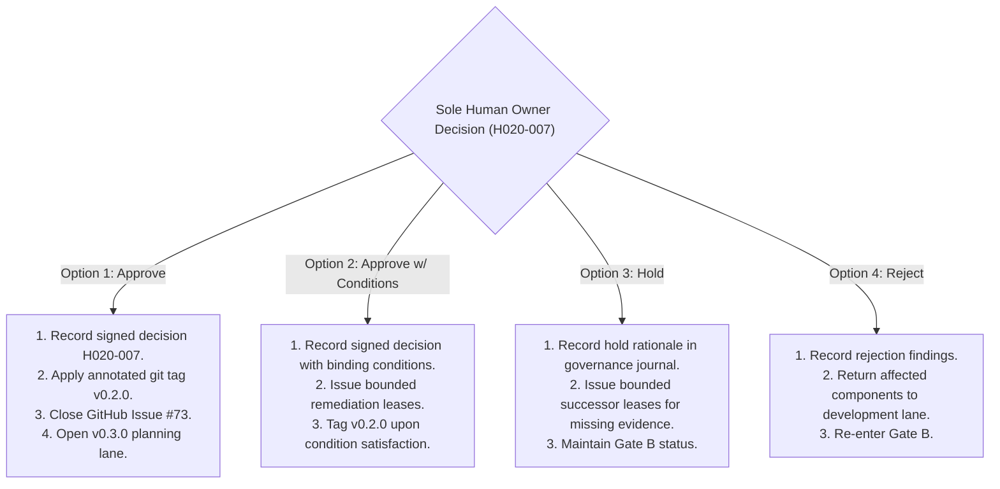

# v0.2.0 Human Release Decision Packet

## 1. Purpose, Governance Authority, and Non-Delegable Invariants

### 1.1 Purpose of this Decision Packet
This decision packet presents the verified, evidence-backed foundation state for Milestone **v0.2.0 — Shared Platform Kernel** to the **Sole Human Owner**. It synthesizes all technical evidence, qualification test outcomes, architectural trust boundaries, threat assessments, known limitations, defect dispositions, and residual risks required to evaluate decision gate **`H020-007`**.

This document is prepared pursuant to GitHub Issue #73 (`[V020-I038] Prepare and Record the v0.2.0 Human Release Decision`) under `LEASE-V020-I038-DECISION-PACKET-PREWORK-326`.

### 1.2 Non-Delegable Human Authority Invariants
In accordance with `ADR-0005` (Sole Human Owner Operating Model) and project governance policies:
1. **Decision Authority Reserved to Human:** Decision gate `H020-007` is **strictly non-delegable**. No AI agent, automated workflow, or sub-agent has the authority to make, record, or approve a milestone release decision.
2. **Zero Release Approval Granted:** This prework document makes **no release decision, no release approval, and no release recommendation**.
3. **Zero Residual-Risk Acceptance:** The AI role **does not accept, waive, or sign off on any residual risk**. All residual risks remain explicitly open and unaccepted, awaiting the Sole Human Owner's sole determination.
4. **All Options Unselected:** All decision options in Section 3 are presented in an unselected, pending state (`[ ] UNSELECTED`).
5. **No External or Protected Action Authorized:** This document grants zero authority for production deployment, cloud provider route activation, external network exposure, cryptographic signing of public distribution artifacts, customer data onboarding, or live commercial execution.

---

## 2. Reconciled Evidence Baseline and Milestone Traceability

### 2.1 Reconciled Foundation Slices and Verification Outcomes
The platform kernel represents the integration of all planned milestone foundations up to base commit `3b600e1cedf03822b42ac4331d2131bb8a69324b`:

| Milestone Component | PR / Commit Baseline | Verified Scope & Evidence Produced | Result |
| :--- | :--- | :--- | :--- |
| **Release Boundary & Walking Skeleton** | Issue #36 / PR #970 | `DOC-V020-REL-BOUNDARY-001`: Ten-step OSHE Inspect walking skeleton critical path (`docs/releases/v0.2.0-release-boundary.md`). | **VERIFIED** |
| **System Context & Trust Boundaries** | `V020-I033` (PR #999, `87b8bb4`) | `SEC-V020-ASSUR-001`: 8 trust boundaries (`TB-01`–`TB-08`), 4-plane tenant isolation model, evidenced control and test mapping across all 9 modules. | **VERIFIED** |
| **Threat Model & Product-Safety Hazard Log** | `V020-I034` (PR #1000, `647d4d5`)| `SEC-V020-THREAT-001` & `RUN-V020-INCIDENT-001`: STRIDE abuse cases (`AC-01`–`AC-07`), PDPA privacy review, hazard log (`HAZ-001`–`HAZ-010`), critical functions (`CF-01`–`CF-09`), incident procedures (`PROC-INC-01`–`PROC-INC-06`). | **VERIFIED** |
| **Local CI & Supply Chain Integrity** | `V020-I035` (PR #995, `82cd668`) | `tools/supply_chain.py`, `tools/run_local_ci.py`: Digest pinning, SBOM/BOM integrity, incremental regression CI. | **VERIFIED** |
| **Walking-Skeleton Integration Harness** | `V020-I036` (PR #1004, `0552840`)| `tests/test_walking_skeleton_integration_harness.py`: Automated end-to-end integration harness executing steps 1–10 across synthetic context, template, inspection, evidence, action, outbox, and export. | **VERIFIED** |
| **Limitations, Defects & Residual Risks** | `V020-I037` (PR #1005, `3b600e1`)| `EVD-V020-DISPOSITION-001`: Evidence-backed limitations (`LIM-01`–`LIM-06`), defect disposition matrix (`DEF-V020-S0`–`S3`), residual-risk register (`RSK-01`–`RSK-05`). | **VERIFIED** |
| **Core Modules Foundation** | Merged Slices `I006`–`I032` | `MOD-ORG`, `MOD-IAM`, `MOD-CFG`, `MOD-WFA`, `MOD-EVD`, `MOD-REC`, `MOD-EVT`, `MOD-REP`, `MOD-CTR`: Passing unit/contract test suites across all 9 module roots. | **VERIFIED** |
| **Database Migration & Recovery** | `V020-I032` (PR #991, `b337494`) | `tests/test_recovery_qualification.py`: Synthetic non-destructive M0-M2 migration, rollback, and recovery qualification. | **VERIFIED** |

### 2.2 Reconciled Defect Disposition Status
Per `EVD-V020-DISPOSITION-001` Section 4:
- **Severity 0 (`S0` — Critical Blocker):** **0 Open / None Observed**. (Zero tolerance satisfied).
- **Severity 1 (`S1` — Major Blocker):** **0 Open / None Observed**. (All walking-skeleton journeys and migration recovery drills passing).
- **Severity 2 / 3 (`S2` / `S3` — Non-Blocking):** **3 Documented Workarounds/Targets**:
  - `DEF-V020-001`: Devcontainer corepack launcher requirements (governed workaround).
  - `DEF-V020-002`: Internal performance metrics treated as engineering targets, not external SLAs (`TST-V020-PLAN-001`).
  - `DEF-V020-003`: Minor UI string truncation on mobile viewports (logged to v0.3.0 backlog).

---

## 3. Explicit Human Decision Options for Gate H020-007

The Sole Human Owner has four mutually exclusive options. **All options are unselected by default:**

```
[ ] OPTION 1: APPROVE AS LOCAL INTERNAL ENGINEERING ALPHA (UNSELECTED)
[ ] OPTION 2: APPROVE WITH MANDATORY OPERATIONAL CONDITIONS (UNSELECTED)
[ ] OPTION 3: HOLD PENDING FURTHER EVIDENCE OR CHALLENGE (UNSELECTED)
[ ] OPTION 4: REJECT AND RETURN TO DEVELOPMENT (UNSELECTED)
```

---

### Option 1: Approve as Local Internal Engineering Alpha
- **Decision Intent:** Accept verified local-synthetic evidence as satisfying Gate C exit criteria for Milestone v0.2.0. Authorize milestone completion and transition to Milestone v0.3.0 planning.
- **Authorized Scope:**
  - Bounded strictly to local development and controlled internal engineering alpha environments (`deploy/local/compose.dev.yaml`).
  - Processing restricted strictly to synthetic or redacted low-risk test fixtures (`V020-D05`).
  - Tagging of git release commit `v0.2.0` in repository history.
- **Explicit Prohibitions:**
  - Zero external public deployment, cloud hosting, commercial route activation, or production signing.
  - Zero live customer or worker PII data ingestion.

---

### Option 2: Approve with Mandatory Operational Conditions
- **Decision Intent:** Accept milestone qualification conditionally, subject to specific, binding operational constraints or prerequisite remediations prior to internal alpha usage.
- **Example Human Conditions:**
  - Condition A: Mandate physical penetration test review of local identity adapter before multi-user internal alpha sessions.
  - Condition B: Require execution of automated restore drills on fresh hardware prior to expanding evaluator seats.
  - Condition C: Retain specific residual risks under monitored operational waivers.

---

### Option 3: Hold Pending Further Evidence or Independent Challenge
- **Decision Intent:** Withhold release approval without rejecting the candidate, requiring additional evidence, extended benchmarks, or specialist challenge before final determination.
- **Next Permitted Action:**
  - Issue bounded successor leases for specified missing tests, load rehearsals, or architecture clarifications.
  - Candidate remains unapproved; release tag `v0.2.0` is withheld.

---

### Option 4: Reject and Return to Development
- **Decision Intent:** Reject the candidate milestone package due to identified architectural, security, or evidentiary deficiencies.
- **Next Permitted Action:**
  - Return affected modules or test harnesses to Gate B development lane with explicit defect tickets.
  - Milestone v0.2.0 remains open and unreleased.

---

## 4. Mandatory Operating Bounds and Governance Conditions

Regardless of which decision option the Sole Human Owner selects, the following architectural and governance boundaries remain **non-negotiable and permanently binding**:

1. **Synthetic Data Invariant (`V020-D05`):** The system operates exclusively on synthetic or redacted low-risk engineering data. Production customer data, real worker personal data, medical diagnoses, and legal-privileged records are strictly prohibited.
2. **Frozen Runtime Profile (`ADR-0002`):** The runtime environment is frozen to the single-node local profile: Go 1.26.5, Node 24.20.0, Python 3.14.7, PostgreSQL 17.11, SeaweedFS 4.29, NATS JetStream 2.14.5, Valkey 9.1.1, and Meilisearch 1.51 (`deploy/local/compose.dev.yaml`).
3. **Zero External Routes (`provider_routes_enabled = 0`):** No external network endpoints, cloud provider APIs, third-party notification relays, or external identity providers are enabled.
4. **Independent Review Invariant (`ADR-0006`):** Any future code or documentation mutations require independent final-diff review and passing local CI prior to merge.

---

## 5. Catalog of Evidence Gaps and Unobserved Runtime Elements

In strict compliance with project truth-in-evidence rules, all unobserved, simulated, or missing components are cataloged below as **UNRESOLVED / NOT EXECUTED** rather than passing:

| Component / Subsystem | Current Foundation Posture | Production Expectation | Qualification Status |
| :--- | :--- | :--- | :--- |
| **PostgreSQL High Availability** | Single-node Docker container (`deploy/local/compose.dev.yaml`) | Multi-node cluster with automated failover (Patroni / PgBouncer) | **UNOBSERVED / DEFERRED** |
| **PostgreSQL Row-Level Security** | Enforced at application layer via `MOD-ORG` `DeriveTenantContext` | Database-level PostgreSQL RLS security policies | **UNOBSERVED / DEFERRED** |
| **SeaweedFS Distributed Storage** | Single-node local S3 emulation (`http://127.0.0.1:8333`) | Multi-rack distributed object store with cloud KMS encryption | **UNOBSERVED / DEFERRED** |
| **NATS JetStream Cluster** | Single-node local message broker without TLS | Clustered NATS broker with mutual TLS (mTLS) authentication | **UNOBSERVED / DEFERRED** |
| **HTTP Network Gateway (`apps/api`)**| Verified via in-memory Go contract tests (`contracts/api`) | Live HTTP daemon listeners with reverse proxy TLS termination, WAF, rate limits | **UNOBSERVED / DEFERRED** |
| **External Identity Providers** | Local synthetic identity emulator issuing cryptographic claims | Live OAuth2 / OIDC / SAML integrations (Entra ID, Okta) | **UNOBSERVED / DEFERRED** |
| **Mobile Edge Sync Daemon** | Causal conflict detection & immutable template snapshots | Background daemon delta sync across physical Android/iOS edge devices | **UNOBSERVED / DEFERRED** |
| **Production Credentials / Keys** | Ephemeral synthetic keys and passwords | Production HSM / KMS managed signing keys and secrets | **UNOBSERVED / DEFERRED** |
| **Independent Challenge for I038** | Prework draft prepared under `LEASE-V020-I038-DECISION-PACKET-PREWORK-326` | Formal independent challenge report from Independent Review Lead | **PENDING REVIEW** |
| **Owner Residual-Risk Sign-Off** | Compiled in `EVD-V020-DISPOSITION-001` Section 5 | Explicit non-delegable human decision record (`H020-007`) | **PENDING DECISION** |

---

## 6. Next Permitted Activity Following Sole Human Owner Decision

Depending on the Sole Human Owner's determination under gate `H020-007`, only the following activities are authorized:



### Strictly Prohibited Post-Decision Actions
Even upon selection of Option 1 (Approve), the following activities remain **strictly prohibited** without separate, explicit human authorization decisions:
- Commercial cloud deployment or production infrastructure provisioning (`requires HCOM-001`).
- Onboarding of live customer organizations or production inspection data (`requires HCOM-002`).
- Removal or weakening of multi-tenant isolation, immutable audit, or fail-closed security controls.

---

## 7. Sole Human Owner Decision Record (Unsigned Template)

*(This section is reserved exclusively for completion and signature by the Sole Human Owner. No automated agent may modify or populate this block.)*

```text
====================================================================================================
                        SOLE HUMAN OWNER DECISION RECORD: GATE H020-007
====================================================================================================

Decision Gate:        H020-007 (Milestone v0.2.0 Shared Platform Kernel Release Decision)
Milestone:            v0.2.0 — Shared Platform Kernel
Governing Decision:   HDEC-V020-GATE-B-APPROVAL-051 (Entry Baseline)
Target Repository:    OSHEThai/oshe-platform
Target Commit Base:   3b600e1cedf03822b42ac4331d2131bb8a69324b
Decision Packet:      docs/qualification/v0.2.0-human-release-decision-packet.md
Limitations Register: docs/qualification/v0.2.0-known-limitations-defect-disposition-and-residual-risk-register.md

SELECTED DISPOSITION:
[ ] OPTION 1: APPROVE AS LOCAL INTERNAL ENGINEERING ALPHA
[ ] OPTION 2: APPROVE WITH MANDATORY OPERATIONAL CONDITIONS
[ ] OPTION 3: HOLD PENDING FURTHER EVIDENCE OR CHALLENGE
[ ] OPTION 4: REJECT AND RETURN TO DEVELOPMENT

BINDING CONDITIONS / WAIVERS / DIRECTIVES (IF APPLICABLE):
----------------------------------------------------------------------------------------------------
[Owner to record conditions, waivers, or remediation requirements here]
----------------------------------------------------------------------------------------------------

RESIDUAL RISK DISPOSITION:
[ ] Residual risks RSK-01 through RSK-05 accepted strictly for internal alpha evaluation within
    the synthetic data boundary (V020-D05).
[ ] Residual risks NOT accepted; remediation required before alpha use.

SIGN-OFF AND EXECUTION:
Sole Human Owner Signature: _________________________________________
Date Signed (UTC):          _________________________________________
Next Authorized Activity:   _________________________________________
====================================================================================================
```
